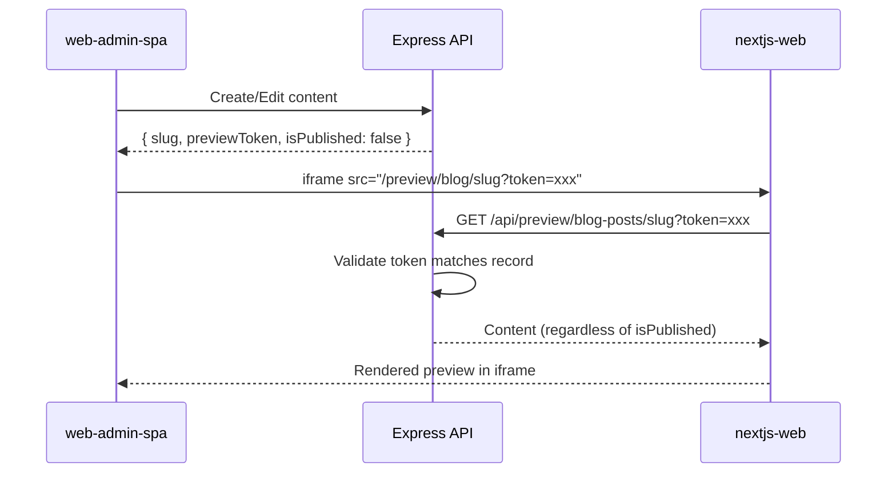

# API Backend Plan

**Grounded to:** All contract deliverables (shared backend infrastructure)

This Express.js + Prisma API serves as the shared backend for all three frontend applications: the public website (nextjs-web), the admin dashboard (web-admin-spa), and the lead generation platform (lead-gen-spa).

---

## Contract Deliverables Supported

| Deliverable | API Responsibilities |
|-------------|---------------------|
| Lead Generation Platform ($8,500) | Lead storage, Google Maps integration, AI qualification, export, usage limits |
| Website Modernization ($4,000) | Tombstones, blog posts, page content, analytics tracking |
| Newsletter/Email Capture ($450) | Email subscribers, Resend integration, automated notifications |

---

## Database Schema (Prisma)

### Core Models

```prisma
// ===========================================
// WEBSITE CONTENT (Website Modernization)
// ===========================================

model Tombstone {
  id           String   @id @default(uuid())
  name         String                         // Company name
  slug         String   @unique               // URL-friendly identifier
  imagePath    String   @map("image_path")    // Path to tombstone image
  industry     String?                        // Industry category
  role         String?                        // Buy-side or Sell-side
  dealDate     DateTime? @map("deal_date")    // When the deal closed
  description  String?                        // Short description
  newsSlug     String?  @map("news_slug")     // Link to related news article
  sortOrder    Int      @default(0) @map("sort_order")
  isPublished  Boolean  @default(true) @map("is_published")
  previewToken String   @unique @default(uuid()) @map("preview_token") // For preview URLs
  createdAt    DateTime @default(now()) @map("created_at")
  updatedAt    DateTime @updatedAt @map("updated_at")

  @@map("tombstones")
}

model BlogPost {
  id           String   @id @default(uuid())
  slug         String   @unique
  title        String
  excerpt      String?
  content      String                         // Markdown content (from BlockNote)
  author       String?
  category     String?                        // news, resource, article
  publishedAt  DateTime? @map("published_at")
  isPublished  Boolean  @default(false) @map("is_published")
  previewToken String   @unique @default(uuid()) @map("preview_token") // For preview URLs
  createdAt    DateTime @default(now()) @map("created_at")
  updatedAt    DateTime @updatedAt @map("updated_at")

  @@index([category, isPublished])
  @@map("blog_posts")
}

model PageContent {
  id           String   @id @default(uuid())
  pageKey      String   @unique @map("page_key") // about, faq, contact, etc.
  title        String
  content      String                            // Markdown or JSON
  metadata     Json?                             // SEO metadata, structured data
  previewToken String   @unique @default(uuid()) @map("preview_token") // For preview URLs
  updatedAt    DateTime @updatedAt @map("updated_at")

  @@map("page_content")
}

// ===========================================
// ANALYTICS (Website Modernization)
// ===========================================

model PageView {
  id        String   @id @default(uuid())
  path      String                            // URL path
  hour      DateTime                          // Truncated to hour for aggregation
  count     Int      @default(1)
  createdAt DateTime @default(now()) @map("created_at")

  @@unique([path, hour])
  @@index([hour])
  @@map("page_views")
}

// ===========================================
// EMAIL & NEWSLETTER (Newsletter/Email Capture)
// ===========================================

model EmailSubscriber {
  id           String   @id @default(uuid())
  email        String   @unique
  name         String?
  source       String?                        // website, intake_form, manual
  isSubscribed Boolean  @default(true) @map("is_subscribed")
  subscribedAt DateTime @default(now()) @map("subscribed_at")
  unsubscribedAt DateTime? @map("unsubscribed_at")

  @@map("email_subscribers")
}

model SellerIntake {
  id            String   @id @default(uuid())
  email         String
  name          String?
  companyName   String?  @map("company_name")
  phone         String?
  message       String?
  source        String?                       // Which form/page
  status        String   @default("new")      // new, contacted, qualified, closed
  createdAt     DateTime @default(now()) @map("created_at")
  updatedAt     DateTime @updatedAt @map("updated_at")

  @@index([status])
  @@map("seller_intakes")
}

model EmailNotification {
  id          String   @id @default(uuid())
  type        String                          // new_tombstone, new_blog_post
  referenceId String   @map("reference_id")   // ID of tombstone or blog post
  sentAt      DateTime @default(now()) @map("sent_at")
  recipientCount Int   @map("recipient_count")

  @@map("email_notifications")
}

// ===========================================
// LEAD GENERATION (Lead Generation Platform)
// ===========================================

model Organization {
  id            String   @id @default(uuid())
  name          String
  usageLimitLeads Int    @default(10000) @map("usage_limit_leads")
  usageLimitExports Int  @default(100) @map("usage_limit_exports")
  createdAt     DateTime @default(now()) @map("created_at")
  
  users         User[]
  leads         Lead[]
  usageRecords  UsageRecord[]

  @@map("organizations")
}

model User {
  id             String   @id @default(uuid())
  email          String   @unique
  name           String?
  cognitoSub     String?  @unique @map("cognito_sub")
  organizationId String?  @map("organization_id")
  role           String   @default("user")    // admin, user
  createdAt      DateTime @default(now()) @map("created_at")
  updatedAt      DateTime @updatedAt @map("updated_at")

  organization   Organization? @relation(fields: [organizationId], references: [id])

  @@map("users")
}

model Lead {
  id              String   @id @default(uuid())
  placeId         String   @unique @map("place_id")  // Google Maps place_id
  organizationId  String   @map("organization_id")
  
  // Basic Info (from Google Maps)
  name            String
  address         String?
  city            String?
  state           String?
  zipCode         String?  @map("zip_code")
  phone           String?
  website         String?
  
  // Google Maps Data
  rating          Float?
  reviewCount     Int?     @map("review_count")
  priceLevel      Int?     @map("price_level")
  businessType    String?  @map("business_type")
  
  // AI Qualification
  qualificationScore Int?  @map("qualification_score")  // 0-100
  qualificationNotes String? @map("qualification_notes")
  qualifiedAt     DateTime? @map("qualified_at")
  
  // Metadata
  source          String?                              // google_maps, manual
  createdAt       DateTime @default(now()) @map("created_at")
  updatedAt       DateTime @updatedAt @map("updated_at")

  organization    Organization @relation(fields: [organizationId], references: [id])

  @@index([organizationId, state])
  @@index([organizationId, businessType])
  @@index([qualificationScore])
  @@map("leads")
}

model UsageRecord {
  id             String   @id @default(uuid())
  organizationId String   @map("organization_id")
  action         String                               // lead_search, export, ai_qualify
  count          Int      @default(1)
  recordedAt     DateTime @default(now()) @map("recorded_at")

  organization   Organization @relation(fields: [organizationId], references: [id])

  @@index([organizationId, action, recordedAt])
  @@map("usage_records")
}

model SearchQuery {
  id             String   @id @default(uuid())
  organizationId String   @map("organization_id")
  query          String                               // Search query text
  location       String?                              // City, state
  businessType   String?  @map("business_type")
  resultsCount   Int      @map("results_count")
  executedAt     DateTime @default(now()) @map("executed_at")

  @@index([organizationId])
  @@map("search_queries")
}
```

---

## API Endpoints

### Public Website Endpoints (nextjs-web)

```
GET  /api/tombstones                 # List published tombstones
GET  /api/tombstones/:slug           # Get single published tombstone
GET  /api/blog-posts                 # List published blog posts
GET  /api/blog-posts/:slug           # Get single published blog post
GET  /api/pages/:pageKey             # Get page content (about, faq, etc.)
POST /api/analytics/pageview         # Record page view
POST /api/subscribe                  # Newsletter signup
POST /api/seller-intake              # Seller intake form submission
```

### Preview Endpoints (nextjs-web preview routes)

```
GET  /api/preview/tombstones/:slug?token=xxx   # Get tombstone by preview token (any publish state)
GET  /api/preview/blog-posts/:slug?token=xxx   # Get blog post by preview token (any publish state)
GET  /api/preview/pages/:pageKey?token=xxx     # Get page content by preview token
```

Preview endpoints:
- Validate the `token` query param matches the record's `previewToken`
- Return content regardless of `isPublished` status
- Rate limited to prevent brute force

### Admin Dashboard Endpoints (web-admin-spa)

```
# Content Management
GET    /api/admin/tombstones         # List all tombstones (including unpublished)
POST   /api/admin/tombstones         # Create tombstone
PUT    /api/admin/tombstones/:id     # Update tombstone
DELETE /api/admin/tombstones/:id     # Delete tombstone
POST   /api/admin/tombstones/:id/publish   # Publish/unpublish

GET    /api/admin/blog-posts         # List all blog posts
POST   /api/admin/blog-posts         # Create blog post
PUT    /api/admin/blog-posts/:id     # Update blog post
DELETE /api/admin/blog-posts/:id     # Delete blog post
POST   /api/admin/blog-posts/:id/publish   # Publish/unpublish

GET    /api/admin/pages              # List page content
PUT    /api/admin/pages/:pageKey     # Update page content

# Email Management
GET    /api/admin/subscribers        # List email subscribers
POST   /api/admin/subscribers        # Add subscriber manually
DELETE /api/admin/subscribers/:id    # Remove subscriber
POST   /api/admin/email/send         # Send email to subscribers (via Resend)

# Analytics
GET    /api/admin/analytics/pageviews       # Get page view stats
GET    /api/admin/analytics/top-pages       # Get top pages
GET    /api/admin/analytics/trends          # Get hourly/daily trends

# Seller Intakes
GET    /api/admin/seller-intakes            # List intake submissions
PUT    /api/admin/seller-intakes/:id        # Update status
```

### Lead Generation Endpoints (lead-gen-spa)

```
# Leads
GET    /api/leads                    # List leads with filters, pagination
GET    /api/leads/:id                # Get single lead
POST   /api/leads/search             # Search Google Maps for leads
POST   /api/leads/:id/qualify        # Run AI qualification on lead
POST   /api/leads/export             # Export leads to CSV

# Usage & Limits
GET    /api/usage                    # Get usage stats for current org
GET    /api/usage/limits             # Get usage limits

# Search History
GET    /api/search-queries           # List past search queries
```

---

## External Service Integrations

### 1. Google Maps API (Lead Generation)

```typescript
// Integration: Google Places Text Search API
// Used for: Finding business leads by query

interface GoogleMapsService {
  searchPlaces(query: string, location?: string): Promise<PlaceResult[]>;
  getPlaceDetails(placeId: string): Promise<PlaceDetails>;
}
```

**Cost**: ~$85 per 100,000 raw leads (as per contract)

### 2. Claude API (Lead Generation)

```typescript
// Integration: Claude for AI qualification
// Used for: Scoring and qualifying leads based on methodology

interface ClaudeService {
  qualifyLead(lead: Lead): Promise<{
    score: number;        // 0-100
    notes: string;        // Qualification reasoning
  }>;
}
```

**Cost**: Variable, typically $10-50/month (as per contract)

### 3. Resend API (Newsletter/Email)

```typescript
// Integration: Resend for email delivery
// Used for: Newsletter, notifications, automated emails

interface ResendService {
  sendEmail(to: string[], subject: string, html: string): Promise<void>;
  sendBatch(emails: BatchEmail[]): Promise<void>;
}
```

---

## Authentication Strategy

### AWS Cognito via Amplify

- **Public endpoints**: No auth required (website content, analytics tracking)
- **Admin endpoints**: Require valid Cognito JWT with admin role
- **Lead gen endpoints**: Require valid Cognito JWT with organization membership

```typescript
// Middleware: auth.ts
interface AuthMiddleware {
  requireAuth(): RequestHandler;           // Any authenticated user
  requireAdmin(): RequestHandler;          // Admin role required
  requireOrganization(): RequestHandler;   // Org membership required
}
```

---

## Content Preview System

### Overview

Admin users can preview unpublished content via secure preview URLs. The preview system uses permanent tokens stored with each content record.



### Security Layers

| Layer | Protection |
|-------|------------|
| **Unguessable tokens** | UUID v4 (122 bits entropy) - impossible to brute force |
| **Token validation** | API validates token matches the specific content record |
| **Rate limiting** | Preview endpoints rate limited (e.g., 10 req/min per IP) |
| **No indexing** | Preview routes return `noindex, nofollow` |
| **Iframe-only** | Preview routes check `Sec-Fetch-Dest: iframe` header |

### Token Lifecycle

1. **Created**: When content is first created, `previewToken` is auto-generated (UUID)
2. **Stable**: Token remains the same during edits (preview URL doesn't change)
3. **Optional regeneration**: On publish, can regenerate token for next draft cycle

### API Implementation

```typescript
// Preview endpoint example
app.get('/api/preview/blog-posts/:slug', rateLimit({ max: 10 }), async (req, res) => {
  const { slug } = req.params;
  const { token } = req.query;
  
  if (!token) {
    return res.status(401).json({ error: 'Preview token required' });
  }
  
  const post = await prisma.blogPost.findUnique({
    where: { slug },
  });
  
  if (!post || post.previewToken !== token) {
    return res.status(404).json({ error: 'Not found or invalid token' });
  }
  
  // Return content regardless of isPublished
  return res.json(post);
});
```

---

## Implementation Checklist

### Phase 1: Database & Core API
- [ ] Extend Prisma schema with all models
- [ ] Run migrations
- [ ] Implement repository layer for each model
- [ ] Implement service layer with business logic
- [ ] Add route handlers

### Phase 2: Website Support
- [ ] Public content endpoints (tombstones, blog, pages)
- [ ] Preview endpoints with token validation
- [ ] Rate limiting on preview endpoints
- [ ] Analytics tracking endpoint
- [ ] Newsletter subscription endpoint
- [ ] Seller intake endpoint

### Phase 3: Admin Dashboard Support
- [ ] Content management CRUD endpoints
- [ ] Email management endpoints (Resend integration)
- [ ] Analytics aggregation endpoints
- [ ] Seller intake management

### Phase 4: Lead Generation Support
- [ ] Google Maps API integration
- [ ] Lead storage and retrieval with filters
- [ ] Claude API integration for qualification
- [ ] Export functionality
- [ ] Usage tracking and limits

---

## Infrastructure Notes

As per contract ongoing costs:
- **RDS Postgres**: ~$15-40/month
- **ECS Fargate (API)**: ~$10-25/month
- **Claude API**: Variable, ~$10-50/month
- **Google search fees**: ~$85 per 100,000 raw leads
