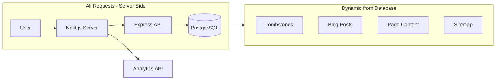

# Website (nextjs-web) Plan

**Grounded to:** Website Modernization ($4,000)

A modern, server-side rendered website optimized for visibility in search engines and AI systems. This is the public-facing website for Flatirons Capital Advisors.

---

## Contract Deliverables Checklist

| Deliverable | Status | Notes |
|-------------|--------|-------|
| Server-side rendered website architecture optimized for SEO and AI citation | Planned | Next.js App Router with SSR |
| Mobile-responsive design | Existing | Tailwind CSS responsive utilities |
| Admin dashboard for managing tombstones and blog posts | Separate App | See web-admin-spa |
| Analytics dashboard for tracking page visits and content performance | Separate App | See web-admin-spa |
| Individually indexed pages for each transaction, cross-linked by industry and role | Planned | Dynamic routes with metadata |
| Google Search Console setup and sitemap submission | Planned | robots.ts + sitemap.ts exist |
| Migration of existing content to the new platform | Planned | Markdown to PostgreSQL |
| Documentation for internal staff on self-service content management | Planned | README for admin workflow |

---

## Architecture

### Current State
- Next.js 16 with App Router
- Content stored in markdown files (`data/` directory)
- Static tombstone mappings in `lib/tombstones.ts`
- Basic pages: Home, About, Buy-side, Contact, FAQ, News, Resources, Team, Transactions, Privacy Policy

### Target State
- Next.js 16 with App Router (unchanged)
- **ALL content dynamically fetched from PostgreSQL via API at request time**
- **NO static generation (SSG) - everything is server-side rendered (SSR)**
- **Sitemap dynamically generated from database on each request**
- Structured data (JSON-LD) for AI citation
- Analytics tracking via API



---

## Dynamic Rendering Requirement

**All content must be rendered server-side from PostgreSQL through the API.** This ensures:

1. **Real-time updates** - Content changes in the admin dashboard appear immediately on the website
2. **No rebuild required** - Adding a tombstone or blog post doesn't require a deployment
3. **Single source of truth** - PostgreSQL is the only content store (no local markdown files)
4. **Dynamic sitemap** - Search engines always see the latest content

### Next.js Configuration

All pages use dynamic rendering (no caching):

```typescript
// Force dynamic rendering for all pages
export const dynamic = 'force-dynamic';
export const revalidate = 0;
```

### Data Fetching Pattern

All data fetching happens server-side in React Server Components:

```typescript
// app/transactions/page.tsx
export const dynamic = 'force-dynamic';

export default async function TransactionsPage() {
  // This runs on the server for every request
  const tombstones = await api.getTombstones();
  
  return (
    <div>
      {tombstones.map(t => (
        <TombstoneCard key={t.id} tombstone={t} />
      ))}
    </div>
  );
}
```

### No Local Content Storage

After migration, the website will have:
- **NO** `data/` directory with markdown files
- **NO** `lib/tombstones.ts` with hardcoded mappings
- **NO** static JSON files for content

Everything comes from the API → PostgreSQL

---

## Page Structure

**All pages fetch content from PostgreSQL via the API at request time (SSR).**

### Existing Pages (all dynamic from database)

| Page | Route | Data Source | SEO Priority |
|------|-------|-------------|--------------|
| Home | `/` | API (PageContent + featured Tombstones) | High |
| About | `/about` | API (PageContent) | Medium |
| Buy-side | `/buy-side` | API (PageContent) | Medium |
| Contact | `/contact` | API (PageContent) | Medium |
| FAQ | `/faq` | API (PageContent with FAQ items) | Medium |
| News | `/news` | API (BlogPost where category=news) | High |
| News Article | `/news/[slug]` | API (BlogPost) | High |
| Resources | `/resources` | API (BlogPost where category=resource) | High |
| Resource Article | `/resources/[slug]` | API (BlogPost) | High |
| Team | `/team` | API (PageContent with team data) | Medium |
| Transactions | `/transactions` | API (Tombstones) | High |
| Privacy Policy | `/privacy-policy` | API (PageContent) | Low |

### New Pages (add for SEO/AI indexing)

| Page | Route | Data Source | Purpose |
|------|-------|-------------|---------|
| Transaction Detail | `/transactions/[slug]` | API (Tombstone) | Individual tombstone pages |
| Industry Index | `/industries` | API (Tombstones grouped) | Industry landing page |
| Industry Detail | `/industries/[industry]` | API (Tombstones filtered) | Industry-specific transactions |

### Special Routes (also dynamic from database)

| Route | Data Source | Notes |
|-------|-------------|-------|
| `/sitemap.xml` | API (all content) | Dynamically generated, no caching |
| `/robots.txt` | Static | Can reference dynamic sitemap URL |

---

## Preview Routes (Admin Only)

Preview routes allow admin users to view unpublished content in an iframe within web-admin-spa.

### Preview Route Structure

| Route | Data Source | Purpose |
|-------|-------------|---------|
| `/preview/transactions/[slug]` | API (any Tombstone via token) | Preview unpublished tombstones |
| `/preview/news/[slug]` | API (any BlogPost via token) | Preview unpublished news |
| `/preview/resources/[slug]` | API (any BlogPost via token) | Preview unpublished resources |
| `/preview/[pageKey]` | API (any PageContent via token) | Preview page content |

### Security Protections

| Protection | Implementation |
|------------|----------------|
| **Token validation** | Query param `?token=xxx` must match record's `previewToken` |
| **No indexing** | `robots: { index: false, follow: false }` metadata |
| **Iframe-only** | Check `Sec-Fetch-Dest: iframe` header, reject direct access |
| **No sitemap** | Preview routes excluded from sitemap |

### Preview Route Implementation

```typescript
// app/preview/news/[slug]/page.tsx
import { headers } from 'next/headers';
import { notFound } from 'next/navigation';
import { Metadata } from 'next';

export const dynamic = 'force-dynamic';

// Prevent indexing
export const metadata: Metadata = {
  robots: {
    index: false,
    follow: false,
  },
};

export default async function PreviewNewsPage({ 
  params, 
  searchParams 
}: { 
  params: { slug: string }; 
  searchParams: { token?: string } 
}) {
  // Check iframe-only access
  const headersList = await headers();
  const secFetchDest = headersList.get('sec-fetch-dest');
  
  if (secFetchDest !== 'iframe') {
    // Not loaded in iframe - reject
    return (
      <div className="p-8 text-center">
        <h1>Preview Not Available</h1>
        <p>Previews can only be viewed from the admin dashboard.</p>
      </div>
    );
  }
  
  const { token } = searchParams;
  
  if (!token) {
    notFound();
  }
  
  // Fetch via preview endpoint (validates token)
  const post = await api.getPreviewBlogPost(params.slug, token);
  
  if (!post) {
    notFound();
  }
  
  // Render with preview banner
  return (
    <>
      <div className="bg-yellow-500 text-black text-center py-2 text-sm font-medium">
        PREVIEW MODE - This content is not published
      </div>
      <BlogPostView post={post} />
    </>
  );
}
```

### Robots.txt Exclusion

```typescript
// app/robots.ts
export default function robots(): MetadataRoute.Robots {
  return {
    rules: {
      userAgent: '*',
      allow: '/',
      disallow: '/preview/', // Block all preview routes
    },
    sitemap: 'https://flatironscapitaladvisors.com/sitemap.xml',
  };
}
```

---

## SEO Optimization

### 1. Metadata Generation

Each page should have dynamic metadata:

```typescript
// Example: Transaction detail page
export async function generateMetadata({ params }: Props): Promise<Metadata> {
  const tombstone = await getTombstone(params.slug);
  
  return {
    title: `${tombstone.name} Transaction | Flatirons Capital Advisors`,
    description: tombstone.description || `${tombstone.name} - ${tombstone.industry} transaction`,
    openGraph: {
      title: tombstone.name,
      description: tombstone.description,
      images: [tombstone.imagePath],
      type: 'article',
    },
    twitter: {
      card: 'summary_large_image',
    },
  };
}
```

### 2. Structured Data (JSON-LD)

Add schema.org markup for AI systems:

```typescript
// Organization schema (site-wide)
const organizationSchema = {
  '@context': 'https://schema.org',
  '@type': 'FinancialService',
  name: 'Flatirons Capital Advisors',
  description: 'M&A advisory firm...',
  url: 'https://flatironscapitaladvisors.com',
  // ...
};

// Article schema (for blog posts)
const articleSchema = {
  '@context': 'https://schema.org',
  '@type': 'Article',
  headline: post.title,
  author: { '@type': 'Person', name: post.author },
  datePublished: post.publishedAt,
  // ...
};

// Transaction schema (for tombstones)
const transactionSchema = {
  '@context': 'https://schema.org',
  '@type': 'Event',
  name: `${tombstone.name} Acquisition`,
  description: tombstone.description,
  // ...
};
```

### 3. Dynamic Sitemap (from Database)

The sitemap is **dynamically generated from PostgreSQL on every request**. This ensures search engines always see the latest content without requiring a rebuild.

```typescript
// app/sitemap.ts
export const dynamic = 'force-dynamic'; // Generate fresh on every request
export const revalidate = 0;

export default async function sitemap(): Promise<MetadataRoute.Sitemap> {
  // Fetch all content from PostgreSQL via API
  const tombstones = await api.getTombstones();
  const blogPosts = await api.getBlogPosts();
  const pages = await api.getPages();
  
  const baseUrl = 'https://flatironscapitaladvisors.com';
  
  return [
    // Core pages (fetched from database)
    ...pages.map(p => ({
      url: `${baseUrl}/${p.pageKey === 'index' ? '' : p.pageKey}`,
      lastModified: p.updatedAt,
      priority: p.pageKey === 'index' ? 1.0 : 0.8,
    })),
    
    // All tombstone pages (from database)
    ...tombstones.map(t => ({
      url: `${baseUrl}/transactions/${t.slug}`,
      lastModified: t.updatedAt,
      priority: 0.7,
    })),
    
    // All blog posts (from database)
    ...blogPosts.map(p => ({
      url: `${baseUrl}/${p.category}/${p.slug}`,
      lastModified: p.updatedAt,
      priority: 0.6,
    })),
    
    // Industry pages (derived from tombstones)
    ...getUniqueIndustries(tombstones).map(industry => ({
      url: `${baseUrl}/industries/${slugify(industry)}`,
      lastModified: new Date(),
      priority: 0.6,
    })),
  ];
}
```

**Key points:**
- `dynamic = 'force-dynamic'` ensures the sitemap is regenerated on every request
- New content appears in the sitemap immediately after being published in the admin
- Search engines crawling `/sitemap.xml` always get the latest URLs

### 4. Robots.txt

Already exists at `robots.ts`. Ensure it allows all public pages.

---

## Cross-linking Strategy

To satisfy the requirement for "cross-linked by industry and role":

### Industry Cross-links
- Each tombstone page links to its industry index
- Industry index pages list all related tombstones
- Example: `/transactions/precision-pool-and-spa` links to `/industries/home-services`

### Role Cross-links
- Tag tombstones as "buy-side" or "sell-side"
- Filter on `/transactions` page by role
- Link from `/buy-side` page to relevant transactions

### News Cross-links
- Tombstones with `newsSlug` link to their news article
- News articles about deals link back to tombstone

---

## Analytics Integration

Track page views by sending to API:

```typescript
// lib/analytics.ts
export async function trackPageView(path: string) {
  if (typeof window === 'undefined') return;
  
  await fetch('/api/analytics/pageview', {
    method: 'POST',
    headers: { 'Content-Type': 'application/json' },
    body: JSON.stringify({ path }),
  });
}

// In layout or page components
useEffect(() => {
  trackPageView(pathname);
}, [pathname]);
```

---

## Content Migration Plan

### Phase 1: Database Setup
1. Deploy API with full Prisma schema
2. Run migrations to create tables
3. Set up admin access via web-admin-spa

### Phase 2: Content Migration
1. Run migration script to import all markdown to database
2. Run migration script to import tombstones.ts mappings to database
3. Verify all content in admin dashboard
4. Test all pages render correctly from API

### Phase 3: Remove Local Content (Final State)
1. Remove `data/` directory entirely
2. Remove `lib/tombstones.ts` file
3. Remove any markdown parsing utilities
4. Update all pages to fetch from API only (no fallbacks)

**After migration, there is NO local content storage. Everything comes from PostgreSQL.**

### Migration Script Outline

```typescript
// scripts/migrate-content.ts
async function migrateContent() {
  // 1. Migrate news articles
  const newsFiles = fs.readdirSync('data/news');
  for (const file of newsFiles) {
    const content = parseMarkdown(file);
    await api.createBlogPost({
      slug: file.replace('.md', ''),
      category: 'news',
      ...content,
    });
  }
  
  // 2. Migrate resource articles
  // Similar pattern
  
  // 3. Migrate tombstones from tombstones.ts
  for (const [name, imagePath] of Object.entries(tombstoneImages)) {
    await api.createTombstone({
      name,
      slug: slugify(name),
      imagePath,
    });
  }
  
  // 4. Migrate page content
  // about.md, faq.md, contact.md, etc.
}
```

---

## Google Search Console Setup

### Steps
1. Verify domain ownership via DNS TXT record
2. Submit sitemap URL: `https://flatironscapitaladvisors.com/sitemap.xml`
3. Request indexing for key pages
4. Monitor coverage report for errors
5. Set up performance tracking

### Sitemap Submission Checklist
- [ ] Generate dynamic sitemap with all pages
- [ ] Verify sitemap is accessible at `/sitemap.xml`
- [ ] Submit to Google Search Console
- [ ] Submit to Bing Webmaster Tools (optional)

---

## Implementation Checklist

### Phase 1: API Integration
- [ ] Create API client library (`lib/api.ts`)
- [ ] Add environment variables for API URL
- [ ] Implement data fetching functions for each content type
- [ ] Add `dynamic = 'force-dynamic'` to all pages
- [ ] Add error handling (no fallbacks to local files)

### Phase 2: Dynamic Pages
- [ ] Create `/transactions/[slug]` page
- [ ] Create `/industries` and `/industries/[industry]` pages
- [ ] Update existing pages to use API data
- [ ] Add loading states and error boundaries
- [ ] Create preview routes (`/preview/...`) with token validation
- [ ] Add iframe-only check to preview routes
- [ ] Add `noindex` to preview routes
- [ ] Add preview banner component

### Phase 3: SEO Enhancement
- [ ] Add JSON-LD structured data to all pages
- [ ] Enhance metadata generation for dynamic pages
- [ ] Update sitemap.ts to fetch all routes from database dynamically
- [ ] Add canonical URLs
- [ ] Ensure sitemap has `dynamic = 'force-dynamic'`

### Phase 4: Analytics & Cross-linking
- [ ] Implement page view tracking
- [ ] Add industry/role cross-links to tombstone pages
- [ ] Link news articles to related tombstones
- [ ] Add "Related Transactions" sections

### Phase 5: Content Migration
- [ ] Write migration scripts
- [ ] Run migration in staging
- [ ] Verify all content in admin
- [ ] Deploy and remove markdown fallbacks

### Phase 6: Google Search Console
- [ ] Verify domain
- [ ] Submit sitemap
- [ ] Request indexing
- [ ] Document process for staff

---

## Documentation for Staff

Create a `README-ADMIN.md` with:
1. How to add a new tombstone (via web-admin-spa)
2. How to add a new blog post/news article
3. How to update page content
4. How content changes appear on the website
5. Expected timeline for changes to be visible
