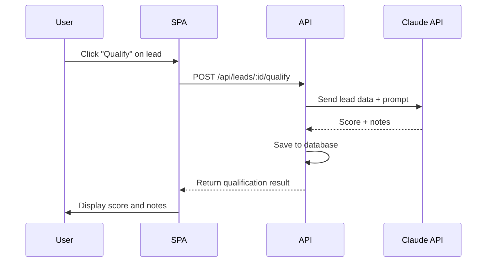

# Lead Generation SPA Plan

**Grounded to:** Lead Generation Platform ($8,500)

A custom-built web-crawling platform that extracts qualified business leads with rich metadata from Google Maps and business websites.

---

## Contract Deliverables Checklist

| Deliverable | Status | Notes |
|-------------|--------|-------|
| Fully functional web-crawling application with user interface | Planned | React SPA + backend crawling |
| Dashboard to query and search leads using intuitive filters | Planned | Filters, pagination, sorting |
| Export functionality for use in Excel or other tools | Planned | CSV export |
| AI-powered lead qualification based on Company's methodology | Planned | Claude API integration |
| Configurable usage limits per organization or account | Planned | Org-level quotas |
| Documentation for internal staff | Planned | In-app help + README |

---

## Tech Stack

| Layer | Technology |
|-------|------------|
| Framework | React 18 + TypeScript |
| Build Tool | Vite |
| Routing | React Router v6 |
| Data Fetching | TanStack Query (React Query) |
| UI Components | shadcn/ui |
| Styling | Tailwind CSS |
| Forms | react-hook-form + zod |
| Tables | TanStack Table |
| Charts | Recharts |
| Auth | AWS Amplify (Cognito) |

---

## Design System

**Aesthetic:** Luxury, high-tech, enterprise, sleek

### Color Palette

```css
/* Dark mode primary - sophisticated dark background */
--background: 224 71% 4%;        /* Near black with blue undertone */
--foreground: 213 31% 91%;       /* Soft white */

/* Card/Surface - subtle elevation */
--card: 224 71% 6%;              /* Slightly lighter than bg */
--card-foreground: 213 31% 91%;

/* Muted - for secondary text */
--muted: 223 47% 11%;
--muted-foreground: 215 20% 65%;

/* Accent - electric blue or emerald */
--primary: 217 91% 60%;          /* Electric blue */
--primary-foreground: 210 40% 98%;

/* Or for emerald variant: */
/* --primary: 160 84% 39%;       /* Emerald green */

/* Success/Qualified leads */
--success: 142 76% 36%;          /* Green */

/* Warning/Approaching limits */
--warning: 38 92% 50%;           /* Amber */

/* Destructive */
--destructive: 0 84% 60%;        /* Red */

/* Border - subtle dividers */
--border: 216 34% 17%;
--ring: 217 91% 60%;
```

### Typography

```css
/* Primary font - clean, modern sans-serif */
font-family: 'Inter', system-ui, sans-serif;

/* Monospace for data/metrics */
font-family: 'JetBrains Mono', 'Fira Code', monospace;
```

| Element | Size | Weight | Tracking |
|---------|------|--------|----------|
| Page Title | 2rem (32px) | 600 | -0.02em |
| Section Header | 1.25rem (20px) | 600 | -0.01em |
| Card Title | 1rem (16px) | 500 | 0 |
| Body | 0.875rem (14px) | 400 | 0 |
| Small/Label | 0.75rem (12px) | 500 | 0.05em |
| Metric Large | 2.5rem (40px) | 700 | -0.02em |

### Visual Elements

**Cards:**
- Subtle border (1px, --border color)
- Very slight background elevation
- No heavy shadows
- Border radius: 12px

**Buttons:**
- Primary: Solid accent color, slight glow on hover
- Secondary: Ghost style with border
- Rounded-lg (8px radius)
- Smooth 150ms transitions

**Tables:**
- Alternating row colors (very subtle)
- Hover state with accent color tint
- Sticky header with blur background
- Compact row height for data density

**Charts (Recharts):**
- Gradient fills (accent color fading to transparent)
- Thin, crisp lines (2px stroke)
- Subtle grid lines (--border color)
- Animated on mount
- Tooltip with glass morphism effect

### Component Styling Examples

**Stats Card:**
```
┌──────────────────────────────────┐
│  TOTAL LEADS                     │  ← Label: 12px, muted, uppercase
│  12,847                          │  ← Metric: 40px, bold, foreground
│  ↑ 12.5% from last month         │  ← Trend: 12px, success/destructive
└──────────────────────────────────┘
```

**Data Table:**
```
┌──────────────────────────────────────────────────────────────────────┐
│ Name              │ Location      │ Rating │ Score │ Campaign       │
├──────────────────────────────────────────────────────────────────────┤
│ ABC Plumbing      │ Denver, CO    │ ★ 4.8  │  87   │ CO-Plumbers    │  ← Row hover: subtle accent tint
│ XYZ Electric      │ Boulder, CO   │ ★ 4.5  │  72   │ CO-Electric    │
└──────────────────────────────────────────────────────────────────────┘
  ^                                                                    ^
  Monospace font for data                                Subtle zebra striping
```

**Sidebar (Persistent - Not Overlay):**

The sidebar is **always visible** and **pushes content** to the right. It does NOT overlay the screen.

```
┌─────────────────────┬──────────────────────────────────────────────────────┐
│  ◆ LEADGEN          │                                                      │
│                     │              MAIN CONTENT AREA                       │
│  Dashboard          │                                                      │
│  Leads              │   Content is pushed right to make room for sidebar   │
│  Campaigns          │                                                      │
│  Export             │              (Never hidden behind sidebar)           │
│                     │                                                      │
│  ─────────────────  │                                                      │
│  Admin              │                                                      │
│  Settings           │                                                      │
│                     │                                                      │
│  ─────────────────  │                                                      │
│  👤 John Smith      │                                                      │
│     readwrite       │                                                      │
└─────────────────────┴──────────────────────────────────────────────────────┘
       240px fixed                    flex-1 (remaining width)
```

**Layout CSS:**
```css
.app-layout {
  display: flex;
  min-height: 100vh;
}

.sidebar {
  width: 240px;
  flex-shrink: 0;        /* Never shrink */
  position: sticky;      /* Stays in place on scroll */
  top: 0;
  height: 100vh;
  overflow-y: auto;
}

.main-content {
  flex: 1;               /* Takes remaining width */
  min-width: 0;          /* Allows content to shrink properly */
  overflow-x: hidden;
}
```

**No drawer/overlay behavior** - the sidebar is always present and content respects its width.

### Tailwind Config Additions

```typescript
// tailwind.config.ts
export default {
  darkMode: 'class',
  theme: {
    extend: {
      colors: {
        // Custom accent colors
        electric: {
          50: '#eff6ff',
          100: '#dbeafe',
          // ...
          500: '#3b82f6',
          600: '#2563eb',
        },
      },
      fontFamily: {
        sans: ['Inter', 'system-ui', 'sans-serif'],
        mono: ['JetBrains Mono', 'Fira Code', 'monospace'],
      },
      animation: {
        'glow': 'glow 2s ease-in-out infinite alternate',
        'fade-in': 'fadeIn 0.5s ease-out',
      },
      keyframes: {
        glow: {
          '0%': { boxShadow: '0 0 5px rgba(59, 130, 246, 0.5)' },
          '100%': { boxShadow: '0 0 20px rgba(59, 130, 246, 0.8)' },
        },
        fadeIn: {
          '0%': { opacity: '0', transform: 'translateY(10px)' },
          '100%': { opacity: '1', transform: 'translateY(0)' },
        },
      },
    },
  },
};
```

### shadcn/ui Theme

Use the "New York" style variant with dark mode:

```bash
npx shadcn@latest init
# Choose: New York style, Slate base color, CSS variables: yes
```

Then customize the CSS variables in `globals.css` with the color palette above.

### Chart Styling (Recharts)

```typescript
// Consistent chart theme
const chartTheme = {
  colors: ['#3b82f6', '#10b981', '#f59e0b', '#ef4444', '#8b5cf6'],
  grid: {
    stroke: 'hsl(216 34% 17%)',
    strokeDasharray: '3 3',
  },
  tooltip: {
    background: 'hsl(224 71% 6%)',
    border: '1px solid hsl(216 34% 17%)',
    borderRadius: '8px',
    boxShadow: '0 4px 6px -1px rgba(0, 0, 0, 0.5)',
  },
  line: {
    strokeWidth: 2,
    dot: false,
    activeDot: { r: 4, fill: '#3b82f6' },
  },
  area: {
    fillOpacity: 0.1,
    stroke: '#3b82f6',
    fill: 'url(#gradient)',
  },
};
```

### Interaction Patterns

- **Hover states**: Subtle glow or accent tint (150ms transition)
- **Focus states**: Ring with accent color
- **Loading**: Skeleton placeholders with shimmer animation
- **Transitions**: Smooth 150-200ms for all interactive elements
- **Toasts**: Bottom-right, dark with accent border

---

## Application Structure

```
src/
├── main.tsx                    # Entry point
├── App.tsx                     # Root component with providers
├── routes.tsx                  # Route definitions
├── pages/
│   ├── Dashboard.tsx           # Analytics dashboard
│   ├── Leads.tsx               # Lead list with filters
│   ├── LeadDetail.tsx          # Single lead view
│   ├── Campaigns.tsx           # Campaign list
│   ├── CampaignDetail.tsx      # Campaign details + run history
│   ├── CampaignCreate.tsx      # Create/edit campaign
│   ├── Admin.tsx               # User management
│   ├── Export.tsx              # Export wizard
│   └── Settings.tsx            # User settings
├── components/
│   ├── layout/
│   │   ├── Sidebar.tsx
│   │   ├── Header.tsx
│   │   └── PageContainer.tsx
│   ├── dashboard/
│   │   ├── StatsCards.tsx
│   │   ├── LeadsLineChart.tsx      # Leads created over time (hourly)
│   │   ├── CampaignsLineChart.tsx  # Campaign runs over time (hourly)
│   │   ├── BusinessTypePieChart.tsx
│   │   └── LocationPieChart.tsx
│   ├── leads/
│   │   ├── LeadTable.tsx
│   │   ├── LeadFilters.tsx
│   │   └── QualificationBadge.tsx
│   ├── campaigns/
│   │   ├── CampaignTable.tsx
│   │   ├── CampaignRunHistory.tsx
│   │   ├── QueryEditor.tsx         # Edit list of search queries
│   │   └── RunCampaignDialog.tsx
│   ├── admin/
│   │   ├── UserTable.tsx
│   │   ├── InviteUserDialog.tsx
│   │   └── RoleBadge.tsx
│   ├── export/
│   │   ├── ExportWizard.tsx
│   │   ├── ColumnSelector.tsx
│   │   └── FilterSummary.tsx
│   └── ui/                     # shadcn/ui components
├── lib/
│   ├── api.ts                  # API client
│   ├── auth.ts                 # Cognito auth helpers
│   └── utils.ts                # Utility functions
├── hooks/
│   ├── useAuth.ts
│   ├── useLeads.ts
│   ├── useCampaigns.ts
│   ├── useUsers.ts
│   └── useDashboard.ts
├── contexts/
│   ├── AuthContext.tsx
│   └── ThemeContext.tsx
└── types/
    └── index.ts                # TypeScript types
```

---

## Page Specifications

### 1. Dashboard (`/`)

Analytics dashboard with visualizations of lead generation activity.

**Layout:**
```
┌─────────────────────────────────────────────────────────────────────┐
│  Total Leads    │  Campaigns Run  │  Qualified    │  Exports       │
│     12,847      │       156       │    8,234      │      47        │
├─────────────────────────────────────────────────────────────────────┤
│  Leads Created Over Time (Hourly)          │  Campaign Runs (Hourly)│
│  ┌─────────────────────────────────────┐   │  ┌──────────────────┐ │
│  │     📈 Line Chart                   │   │  │   📈 Line Chart  │ │
│  │     Hour-by-hour granularity        │   │  │                  │ │
│  └─────────────────────────────────────┘   │  └──────────────────┘ │
├─────────────────────────────────────────────────────────────────────┤
│  Business Type Distribution        │  Location Distribution         │
│  ┌───────────────────────────┐     │  ┌───────────────────────────┐│
│  │      🥧 Pie Chart         │     │  │      🥧 Pie Chart         ││
│  │  Plumber: 23%             │     │  │  Colorado: 45%            ││
│  │  HVAC: 18%                │     │  │  Texas: 22%               ││
│  │  Electrician: 15%         │     │  │  Arizona: 18%             ││
│  └───────────────────────────┘     │  └───────────────────────────┘│
└─────────────────────────────────────────────────────────────────────┘
```

**Components:**
- **Stats Cards**: Total leads, campaigns run, qualified leads, exports
- **Leads Line Chart**: Leads created with hour-by-hour granularity (last 7 days default)
- **Campaigns Line Chart**: Campaign runs with hour-by-hour granularity (last 7 days default)
- **Business Type Pie Chart**: Distribution of business types across all leads
- **Location Pie Chart**: Distribution of states/cities across all leads

**Date Range Filter:**
- Last 24 hours, Last 7 days, Last 30 days, Custom range
- Applies to both line charts

**API Calls:**
- `GET /api/leadgen/dashboard/stats`
- `GET /api/leadgen/dashboard/leads-over-time?start=&end=&granularity=hour`
- `GET /api/leadgen/dashboard/campaigns-over-time?start=&end=&granularity=hour`
- `GET /api/leadgen/dashboard/business-type-distribution`
- `GET /api/leadgen/dashboard/location-distribution`

---

### 2. Leads (`/leads`)

Paginated table of all leads with **server-side filtering** on any column.

**Features:**
- Table view with columns: Name, City, State, Phone, Website, Rating, Business Type, Campaign, Qualification Score, Created At
- **Server-side filtering** on any column or multiple columns:
  - Text search: Name, City, Address
  - Multi-select: State, Business Type
  - Range: Rating (min/max), Qualification Score (min/max)
  - Boolean: Has Website, Has Phone
  - Relation: Campaign (select which campaign)
- **Server-side pagination**: 25/50/100 per page
- **Server-side sorting**: Click column headers
- **Campaign link**: Each lead links to its source campaign
- Bulk actions: Export selected, Qualify selected

**Filter Panel:**
```
┌─────────────────────────────────────────────────────────────────────┐
│ Filters                                                  [Clear All]│
├─────────────────────────────────────────────────────────────────────┤
│ Name contains: [________]  │ State: [CO ▼] [TX ▼] [+]              │
│ City contains: [________]  │ Business Type: [Plumber ▼] [+]        │
│ Campaign: [All Campaigns ▼]│ Rating: [3.0] ━━━━━ [5.0]             │
│ Has Website: [Any ▼]       │ Qualification: [0] ━━━━━ [100]        │
└─────────────────────────────────────────────────────────────────────┘
│ Showing 1,234 of 12,847 leads                    [25▼] per page    │
└─────────────────────────────────────────────────────────────────────┘
```

**API Calls:**
- `GET /api/leadgen/leads?page=1&limit=25&sort=createdAt&order=desc&filters={...}`
  - All filtering, sorting, and pagination happens server-side
  - Returns: `{ data: Lead[], total: number, page: number, totalPages: number }`

```typescript
interface LeadFilters {
  name?: string;              // ILIKE search
  city?: string;              // ILIKE search
  states?: string[];          // IN clause
  businessTypes?: string[];   // IN clause
  campaignId?: string;        // Exact match
  ratingMin?: number;
  ratingMax?: number;
  qualificationMin?: number;
  qualificationMax?: number;
  hasWebsite?: boolean;
  hasPhone?: boolean;
}
```

---

### 3. Lead Detail (`/leads/:id`)

View full details of a single lead.

**Sections:**
- Basic info: Name, address, phone, website
- Google Maps data: Rating, review count, business type
- **Source Campaign**: Link to the campaign that created this lead
- AI Qualification: Score (0-100), qualification notes
- Actions: Re-qualify, Delete, Add to export

**API Calls:**
- `GET /api/leadgen/leads/:id`
- `POST /api/leadgen/leads/:id/qualify` (trigger AI qualification)

---

### 4. Campaigns (`/campaigns`)

List of all campaigns. A campaign is a list of Google search queries.

**Features:**
- Table view: Name, Query Count, Total Leads, Last Run, Created At
- Actions: View, Edit, Run, Delete
- Create new campaign button

**API Calls:**
- `GET /api/leadgen/campaigns`
- `DELETE /api/leadgen/campaigns/:id`

---

### 5. Campaign Detail (`/campaigns/:id`)

View campaign details and run history.

**Sections:**

**Campaign Info:**
- Name, description
- Query count (how many search queries)
- Total leads generated (across all runs)
- Created by, created at

**Query List:**
- Scrollable list of all Google search queries in this campaign
- Example: "plumbers in Denver CO", "HVAC contractors in Boulder CO", ...

**Run History:**
```
┌─────────────────────────────────────────────────────────────────────┐
│ Run History                                              [Run Now]  │
├─────────────────────────────────────────────────────────────────────┤
│ Run #  │ Started At       │ Status    │ Queries │ Leads Found │    │
├────────┼──────────────────┼───────────┼─────────┼─────────────┼────┤
│ 12     │ Jan 29, 2:30 PM  │ Completed │ 150     │ 892         │ ⋯  │
│ 11     │ Jan 22, 10:00 AM │ Completed │ 150     │ 743         │ ⋯  │
│ 10     │ Jan 15, 9:15 AM  │ Failed    │ 150     │ 0           │ ⋯  │
│ ...    │                  │           │         │             │    │
└─────────────────────────────────────────────────────────────────────┘
```

**Run Metrics (expandable per run):**
- Queries executed
- Leads found
- Duplicates skipped
- Errors
- Duration
- Cost estimate

**API Calls:**
- `GET /api/leadgen/campaigns/:id` (includes query list)
- `GET /api/leadgen/campaigns/:id/runs` (paginated run history)
- `POST /api/leadgen/campaigns/:id/run` (trigger new run)

---

### 6. Campaign Create/Edit (`/campaigns/new`, `/campaigns/:id/edit`)

Create or edit a campaign.

**Form Fields:**
- Name (required)
- Description (optional)
- Queries (textarea, one per line)

**Query Editor:**
```
┌─────────────────────────────────────────────────────────────────────┐
│ Search Queries (one per line)                                       │
├─────────────────────────────────────────────────────────────────────┤
│ plumbers in Denver CO                                               │
│ plumbers in Boulder CO                                              │
│ plumbers in Colorado Springs CO                                     │
│ HVAC contractors in Denver CO                                       │
│ HVAC contractors in Boulder CO                                      │
│ ...                                                                 │
├─────────────────────────────────────────────────────────────────────┤
│ 127 queries                                              [Validate] │
└─────────────────────────────────────────────────────────────────────┘
```

**API Calls:**
- `POST /api/leadgen/campaigns` (create)
- `PUT /api/leadgen/campaigns/:id` (update)

---

### 7. Admin (`/admin`)

User management for the organization. **Only visible to admin role users.**

**User Roles:**

| Role | Permissions |
|------|-------------|
| **readonly** | View everything, but cannot run campaigns or manage users |
| **readwrite** | Everything except manage users (can run campaigns, export, qualify) |
| **admin** | Full access including user management |

**Features:**
- Table of users: Email, Name, Role, Invited At, Last Active
- Invite new user (sends email invitation)
- Change user role (admin only)
- Remove user from organization (admin only)

**Layout:**
```
┌─────────────────────────────────────────────────────────────────────┐
│ Team Members                                          [Invite User] │
├─────────────────────────────────────────────────────────────────────┤
│ Email              │ Name         │ Role      │ Last Active  │     │
├────────────────────┼──────────────┼───────────┼──────────────┼─────┤
│ john@company.com   │ John Smith   │ admin     │ 2 hours ago  │ ⋯   │
│ jane@company.com   │ Jane Doe     │ readwrite │ 1 day ago    │ ⋯   │
│ bob@company.com    │ Bob Wilson   │ readonly  │ 3 days ago   │ ⋯   │
└─────────────────────────────────────────────────────────────────────┘
```

**Invite User Dialog:**
- Email address (required)
- Name (optional)
- Role (readonly / readwrite / admin)
- Sends invitation email via Cognito

**API Calls:**
- `GET /api/leadgen/users` (list users in org)
- `POST /api/leadgen/users/invite` (invite new user)
- `PUT /api/leadgen/users/:id/role` (change role)
- `DELETE /api/leadgen/users/:id` (remove from org)

---

### 8. Export (`/export`)

Export leads to CSV/Excel.

**Export Wizard Steps:**
1. **Select filters**: Same filters as leads page, or "all leads"
2. **Select columns**: Checkbox list of available fields
3. **Preview**: Show first 10 rows
4. **Export**: Download CSV file

**Available Columns:**
- Name, Address, City, State, Zip Code
- Phone, Website
- Rating, Review Count
- Business Type
- Campaign Name
- Qualification Score, Qualification Notes
- Date Added

**API Calls:**
- `GET /api/leadgen/leads/count?filters=...` (show count before export)
- `POST /api/leadgen/leads/export` (returns CSV download URL)

---

### 9. Settings (`/settings`)

User and organization settings.

**Features:**
- User profile
- Organization name (read-only for non-admins)
- Usage limits display
- Default export columns

---

## AI-Powered Lead Qualification

### Qualification Flow



### Qualification Prompt (Example)

```
You are evaluating a business lead for potential M&A advisory services.

Business Information:
- Name: {name}
- Type: {businessType}
- Location: {city}, {state}
- Rating: {rating}/5 ({reviewCount} reviews)
- Website: {website}

Evaluate this business on a scale of 0-100 based on:
1. Business maturity (established vs new)
2. Online presence quality
3. Review sentiment and volume
4. Industry acquisition potential
5. Geographic desirability

Return a JSON object:
{
  "score": <number 0-100>,
  "notes": "<bullet points explaining the score>"
}
```

### Bulk Qualification

- Select multiple leads on the leads page
- Click "Qualify Selected"
- Progress indicator shows processing
- Rate limited to avoid Claude API overuse

---

## Usage Limits

### Per-Organization Limits

```typescript
interface UsageLimits {
  leadsPerMonth: number;      // Default 10,000
  exportsPerMonth: number;    // Default 100
  qualificationsPerMonth: number; // Default 1,000
}

interface UsageStats {
  leadsThisMonth: number;
  exportsThisMonth: number;
  qualificationsThisMonth: number;
  periodStart: Date;
  periodEnd: Date;
}
```

### Enforcement

- Check limits before operations
- Show warning at 80% usage
- Block operations at 100% usage
- Admin can adjust limits per organization

---

## Filters Deep Dive

### Filter UI Components

```
┌─────────────────────────────────────────────────────────────────┐
│ Filters                                              [Clear All]│
├─────────────────────────────────────────────────────────────────┤
│ State          │ City           │ Business Type                 │
│ ┌───────────┐  │ ┌───────────┐  │ ┌───────────┐                │
│ │ CO      ☑ │  │ │ Denver    │  │ │ Plumber ☑ │                │
│ │ TX      ☑ │  │ └───────────┘  │ │ HVAC    ☑ │                │
│ │ AZ      ☐ │  │                │ │ Electric☐ │                │
│ └───────────┘  │                │ └───────────┘                │
├─────────────────────────────────────────────────────────────────┤
│ Rating         │ Qualification  │ Contact Info                  │
│ ●━━━━━━━━━━●   │ ●━━━━━━━━━━●   │ ☑ Has Website                │
│ 3.0 ─────  5.0 │ 50 ─────  100  │ ☑ Has Phone                  │
└─────────────────────────────────────────────────────────────────┘
│ Showing 1,234 leads matching filters                    [Export]│
└─────────────────────────────────────────────────────────────────┘
```

### Filter State Management

```typescript
interface LeadFilters {
  states?: string[];
  city?: string;
  businessTypes?: string[];
  ratingMin?: number;
  ratingMax?: number;
  qualificationMin?: number;
  qualificationMax?: number;
  hasWebsite?: boolean;
  hasPhone?: boolean;
}
```

---

## Authentication

Same pattern as web-admin-spa:
- AWS Cognito via Amplify
- JWT tokens in Authorization header
- Organization membership required

---

## Implementation Checklist

### Phase 1: Project Setup
- [ ] Initialize Vite + React + TypeScript project
- [ ] Configure Tailwind CSS
- [ ] Install and configure shadcn/ui
- [ ] Install Recharts for charts
- [ ] Set up React Router
- [ ] Configure TanStack Query
- [ ] Set up AWS Amplify for auth

### Phase 2: Authentication & Authorization
- [ ] Implement login flow with Cognito
- [ ] Create AuthContext and useAuth hook
- [ ] Add protected route wrapper
- [ ] Handle organization membership
- [ ] Implement role-based route protection (readonly/readwrite/admin)

### Phase 3: Layout & Navigation
- [ ] Create persistent sidebar (fixed width, not overlay)
- [ ] Implement flex layout (sidebar + main content)
- [ ] Create header with user menu and org display
- [ ] Create page container component
- [ ] Role-based navigation (hide Admin for non-admins)

### Phase 4: Dashboard
- [ ] Stats cards component
- [ ] Leads over time line chart (hourly granularity)
- [ ] Campaign runs over time line chart (hourly granularity)
- [ ] Business type pie chart
- [ ] Location distribution pie chart
- [ ] Date range picker

### Phase 5: Leads List
- [ ] Leads table with server-side pagination
- [ ] Server-side filtering on all columns
- [ ] Filter panel UI
- [ ] Sorting by column headers
- [ ] Campaign link column
- [ ] Bulk selection

### Phase 6: Lead Details & Qualification
- [ ] Lead detail page
- [ ] Campaign source display
- [ ] AI qualification display
- [ ] Qualify action (single and bulk)
- [ ] Progress indicator for bulk

### Phase 7: Campaigns
- [ ] Campaign list page
- [ ] Campaign detail page with run history
- [ ] Create/edit campaign form
- [ ] Query editor (textarea, one per line)
- [ ] Run campaign dialog
- [ ] Run metrics display

### Phase 8: Admin (User Management)
- [ ] User table with role badges
- [ ] Invite user dialog
- [ ] Change role functionality
- [ ] Remove user functionality
- [ ] Role-based access control

### Phase 9: Export
- [ ] Export wizard
- [ ] Column selector (including campaign)
- [ ] Filter summary
- [ ] CSV download

### Phase 10: Polish
- [ ] Loading states and skeletons
- [ ] Error handling and toasts
- [ ] Help tooltips
- [ ] Documentation

---

## Backend Requirements (API)

### Endpoints Needed

See `src/api/PLAN.md` for full endpoint documentation. Key endpoints:

```
# Dashboard
GET  /api/leadgen/dashboard/stats
GET  /api/leadgen/dashboard/leads-over-time
GET  /api/leadgen/dashboard/campaigns-over-time
GET  /api/leadgen/dashboard/business-type-distribution
GET  /api/leadgen/dashboard/location-distribution

# Leads (server-side filtering)
GET  /api/leadgen/leads
GET  /api/leadgen/leads/:id
POST /api/leadgen/leads/:id/qualify
POST /api/leadgen/leads/export

# Campaigns
GET  /api/leadgen/campaigns
GET  /api/leadgen/campaigns/:id
POST /api/leadgen/campaigns
PUT  /api/leadgen/campaigns/:id
POST /api/leadgen/campaigns/:id/run
GET  /api/leadgen/campaigns/:id/runs

# User Management
GET  /api/leadgen/users
POST /api/leadgen/users/invite
PUT  /api/leadgen/users/:id/role
DELETE /api/leadgen/users/:id
```

### Database Models Needed

- **Lead** - with `campaignId` and `campaignRunId` relations
- **Campaign** - name, description, queries array
- **CampaignRun** - status, metrics, timestamps
- **User** - with `role` (readonly/readwrite/admin)

### Google Maps Integration

```typescript
// Google Places Text Search API
interface GoogleMapsService {
  textSearch(query: string): Promise<PlaceResult[]>;
}

// Called during campaign run
async function executeCampaignRun(campaign: Campaign, run: CampaignRun) {
  for (const query of campaign.queries) {
    const results = await googleMaps.textSearch(query);
    
    for (const place of results) {
      // Check for duplicates
      const exists = await prisma.lead.findUnique({ 
        where: { placeId: place.place_id } 
      });
      
      if (exists) {
        run.duplicatesSkipped++;
        continue;
      }
      
      await prisma.lead.create({
        data: {
          ...mapToLead(place),
          organizationId: campaign.organizationId,
          campaignId: campaign.id,
          campaignRunId: run.id,
        },
      });
      run.leadsFound++;
    }
    run.queriesExecuted++;
  }
}
```

---

## Cost Notes (from Contract)

| Service | Cost |
|---------|------|
| Google Places API | ~$85 per 100,000 raw leads |
| Claude API (qualification) | Variable, typically $10-50/month |
| RDS Postgres | ~$15-40/month |
| ECS Fargate (API) | ~$10-25/month |

---

## Documentation for Staff

Create a `README-USER.md` with:
1. How to search for new leads
2. Understanding the filter options
3. How AI qualification works
4. How to export leads
5. Understanding usage limits
6. Troubleshooting common issues
