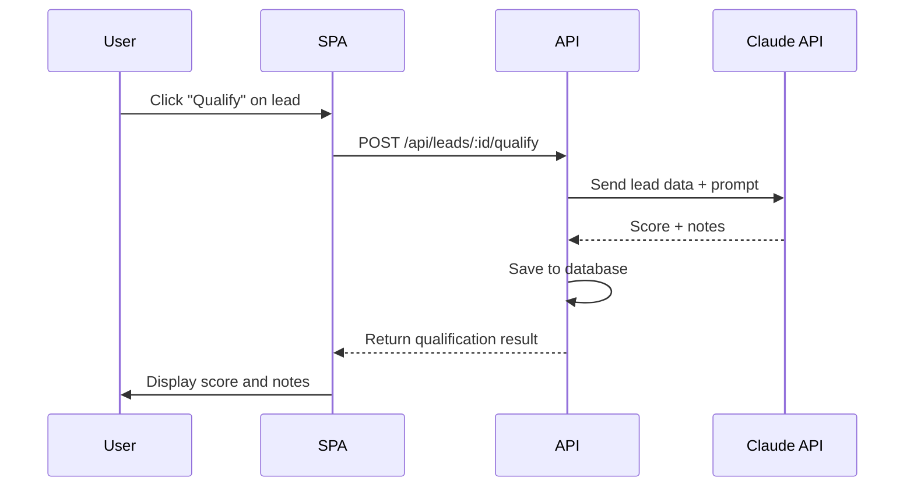

# Lead Generation SPA Plan

**Grounded to:** Lead Generation Platform ($8,500)

A custom-built web-crawling platform that extracts qualified business leads with rich metadata from Google Maps and business websites. This is a simplified version of the savon-cdk admin-app pattern.

---

## Contract Deliverables Checklist

| Deliverable | Status | Notes |
|-------------|--------|-------|
| Fully functional web-crawling application with user interface | Planned | React SPA + backend crawling |
| Dashboard to query and search leads using intuitive filters | Planned | Filters, pagination, sorting |
| Export functionality for use in Excel or other tools | Planned | CSV export |
| AI-powered lead qualification based on Company's methodology | Planned | Claude API integration |
| Configurable usage limits per organization or account | Planned | Org-level quotas |
| Documentation for internal staff | Planned | In-app help + README |

---

## Comparison: savon-cdk admin-app vs fca lead-gen-spa

| Feature | savon-cdk | fca (Simpler) |
|---------|-----------|---------------|
| Campaign Management | Full CRUD with search queries | Not needed - direct search |
| Job Queue | Complex pipeline jobs | Simplified - inline processing |
| Business Details Pipeline | Multi-step (details, reviews, photos, copy, scrape) | Single step - basic Google Maps data + AI qualify |
| Pricing Tiers | Pro/Enterprise/Enterprise+ | Single tier |
| Web Scraping | Full scrape with cloudscraper/puppeteer | Not included (out of scope) |
| Cost Tracking | Detailed per-operation costs | Basic usage counting |
| Query Generation | City database + regional presets | Manual query entry only |

---

## Tech Stack

| Layer | Technology |
|-------|------------|
| Framework | React 18 + TypeScript |
| Build Tool | Vite |
| Routing | React Router v6 |
| Data Fetching | TanStack Query (React Query) |
| UI Components | shadcn/ui |
| Styling | Tailwind CSS |
| Forms | react-hook-form + zod |
| Tables | TanStack Table |
| Auth | AWS Amplify (Cognito) |

---

## Application Structure

```
src/
├── main.tsx                    # Entry point
├── App.tsx                     # Root component with providers
├── routes.tsx                  # Route definitions
├── pages/
│   ├── Dashboard.tsx           # Stats overview
│   ├── Search.tsx              # Search for new leads
│   ├── Leads.tsx               # Lead list with filters
│   ├── LeadDetail.tsx          # Single lead view
│   ├── Export.tsx              # Export wizard
│   ├── Usage.tsx               # Usage stats and limits
│   └── Settings.tsx            # User settings
├── components/
│   ├── layout/
│   │   ├── Sidebar.tsx
│   │   ├── Header.tsx
│   │   └── PageContainer.tsx
│   ├── leads/
│   │   ├── LeadTable.tsx
│   │   ├── LeadCard.tsx
│   │   ├── LeadFilters.tsx
│   │   └── QualificationBadge.tsx
│   ├── search/
│   │   ├── SearchForm.tsx
│   │   ├── SearchResults.tsx
│   │   └── LocationPicker.tsx
│   ├── export/
│   │   ├── ExportWizard.tsx
│   │   ├── ColumnSelector.tsx
│   │   └── FilterSummary.tsx
│   └── ui/                     # shadcn/ui components
├── lib/
│   ├── api.ts                  # API client
│   ├── auth.ts                 # Cognito auth helpers
│   └── utils.ts                # Utility functions
├── hooks/
│   ├── useAuth.ts
│   ├── useLeads.ts
│   ├── useSearch.ts
│   └── useUsage.ts
├── contexts/
│   ├── AuthContext.tsx
│   └── ThemeContext.tsx
└── types/
    └── index.ts                # TypeScript types
```

---

## Page Specifications

### 1. Dashboard (`/`)

Overview of lead generation activity and usage.

**Components:**
- Stats cards: Total leads, qualified leads, searches this month, exports this month
- Recent searches: Last 5 search queries with result counts
- Usage meter: Visual progress toward limits
- Quick actions: New search, View leads, Export

**API Calls:**
- `GET /api/usage`
- `GET /api/search-queries?limit=5`

---

### 2. Search (`/search`)

Search Google Maps for new business leads.

**Features:**
- Search query input (e.g., "plumbers in Denver CO")
- Optional location refinement
- Results preview before saving
- Save selected leads to database
- Deduplication against existing leads

**Workflow:**
1. Enter search query
2. Click "Search" → API calls Google Maps
3. View results in preview table
4. Select leads to save (checkboxes)
5. Click "Save Selected" → Leads stored in database
6. Usage counter incremented

**API Calls:**
- `POST /api/leads/search` (returns preview, not saved yet)
- `POST /api/leads/save` (saves selected leads)

```typescript
// Search request
interface SearchRequest {
  query: string;           // "plumbers in Denver CO"
  maxResults?: number;     // Default 20, max 60
}

// Search response (preview)
interface SearchResponse {
  results: LeadPreview[];
  totalFound: number;
  alreadyExists: string[]; // place_ids already in database
}
```

---

### 3. Leads (`/leads`)

Browse and filter saved leads.

**Features:**
- Table view with columns: Name, Address, City, State, Phone, Website, Rating, Qualification Score
- **Intuitive filters** (contract requirement):
  - State (multi-select)
  - City (text search)
  - Business type (multi-select)
  - Rating (min/max slider)
  - Qualification score (min/max slider)
  - Has website (yes/no/all)
  - Has phone (yes/no/all)
- Sorting: By name, city, rating, qualification score, date added
- Pagination: 25/50/100 per page
- Bulk actions: Export selected, Qualify selected

**API Calls:**
- `GET /api/leads?filters=...&page=...&sort=...`
- `GET /api/leads/count?filters=...` (for filter badges)

---

### 4. Lead Detail (`/leads/:id`)

View full details of a single lead.

**Sections:**
- Basic info: Name, address, phone, website
- Google Maps data: Rating, review count, business type
- AI Qualification: Score (0-100), qualification notes
- Actions: Re-qualify, Delete, Add to export

**AI Qualification Display:**
```
┌─────────────────────────────────────────┐
│ Qualification Score: 78/100      ██████░│
├─────────────────────────────────────────┤
│ Qualification Notes:                    │
│ - Established business (5+ years)       │
│ - Strong online presence                │
│ - Good review sentiment                 │
│ - Potential acquisition target          │
└─────────────────────────────────────────┘
```

**API Calls:**
- `GET /api/leads/:id`
- `POST /api/leads/:id/qualify` (trigger AI qualification)

---

### 5. Export (`/export`)

Export leads to CSV/Excel.

**Export Wizard Steps:**
1. **Select filters**: Same filters as leads page, or "all leads"
2. **Select columns**: Checkbox list of available fields
3. **Preview**: Show first 10 rows
4. **Export**: Download CSV file

**Available Columns:**
- Name, Address, City, State, Zip Code
- Phone, Website
- Rating, Review Count
- Business Type
- Qualification Score, Qualification Notes
- Date Added

**API Calls:**
- `GET /api/leads/count?filters=...` (show count before export)
- `POST /api/leads/export` (returns CSV download URL)

---

### 6. Usage (`/usage`)

View usage statistics and remaining limits.

**Components:**
- Current period usage (leads searched, exports made)
- Usage limits (per organization)
- Usage history chart (last 30 days)
- Limit warnings (approaching limit)

**API Calls:**
- `GET /api/usage`
- `GET /api/usage/limits`
- `GET /api/usage/history`

---

### 7. Settings (`/settings`)

User and organization settings.

**Features:**
- User profile
- Organization name (read-only)
- Usage limits display
- Default export columns

---

## AI-Powered Lead Qualification

### Qualification Flow



### Qualification Prompt (Example)

```
You are evaluating a business lead for potential M&A advisory services.

Business Information:
- Name: {name}
- Type: {businessType}
- Location: {city}, {state}
- Rating: {rating}/5 ({reviewCount} reviews)
- Website: {website}

Evaluate this business on a scale of 0-100 based on:
1. Business maturity (established vs new)
2. Online presence quality
3. Review sentiment and volume
4. Industry acquisition potential
5. Geographic desirability

Return a JSON object:
{
  "score": <number 0-100>,
  "notes": "<bullet points explaining the score>"
}
```

### Bulk Qualification

- Select multiple leads on the leads page
- Click "Qualify Selected"
- Progress indicator shows processing
- Rate limited to avoid Claude API overuse

---

## Usage Limits

### Per-Organization Limits

```typescript
interface UsageLimits {
  leadsPerMonth: number;      // Default 10,000
  exportsPerMonth: number;    // Default 100
  qualificationsPerMonth: number; // Default 1,000
}

interface UsageStats {
  leadsThisMonth: number;
  exportsThisMonth: number;
  qualificationsThisMonth: number;
  periodStart: Date;
  periodEnd: Date;
}
```

### Enforcement

- Check limits before operations
- Show warning at 80% usage
- Block operations at 100% usage
- Admin can adjust limits per organization

---

## Filters Deep Dive

### Filter UI Components

```
┌─────────────────────────────────────────────────────────────────┐
│ Filters                                              [Clear All]│
├─────────────────────────────────────────────────────────────────┤
│ State          │ City           │ Business Type                 │
│ ┌───────────┐  │ ┌───────────┐  │ ┌───────────┐                │
│ │ CO      ☑ │  │ │ Denver    │  │ │ Plumber ☑ │                │
│ │ TX      ☑ │  │ └───────────┘  │ │ HVAC    ☑ │                │
│ │ AZ      ☐ │  │                │ │ Electric☐ │                │
│ └───────────┘  │                │ └───────────┘                │
├─────────────────────────────────────────────────────────────────┤
│ Rating         │ Qualification  │ Contact Info                  │
│ ●━━━━━━━━━━●   │ ●━━━━━━━━━━●   │ ☑ Has Website                │
│ 3.0 ─────  5.0 │ 50 ─────  100  │ ☑ Has Phone                  │
└─────────────────────────────────────────────────────────────────┘
│ Showing 1,234 leads matching filters                    [Export]│
└─────────────────────────────────────────────────────────────────┘
```

### Filter State Management

```typescript
interface LeadFilters {
  states?: string[];
  city?: string;
  businessTypes?: string[];
  ratingMin?: number;
  ratingMax?: number;
  qualificationMin?: number;
  qualificationMax?: number;
  hasWebsite?: boolean;
  hasPhone?: boolean;
}
```

---

## Authentication

Same pattern as web-admin-spa:
- AWS Cognito via Amplify
- JWT tokens in Authorization header
- Organization membership required

---

## Implementation Checklist

### Phase 1: Project Setup
- [ ] Initialize Vite + React + TypeScript project
- [ ] Configure Tailwind CSS
- [ ] Install and configure shadcn/ui
- [ ] Set up React Router
- [ ] Configure TanStack Query
- [ ] Set up AWS Amplify for auth

### Phase 2: Authentication
- [ ] Implement login flow with Cognito
- [ ] Create AuthContext and useAuth hook
- [ ] Add protected route wrapper
- [ ] Handle organization membership

### Phase 3: Layout & Navigation
- [ ] Create sidebar navigation
- [ ] Create header with user menu and org display
- [ ] Create page container component
- [ ] Add usage indicator in header

### Phase 4: Search Feature
- [ ] Search form with query input
- [ ] Search results preview table
- [ ] Save selected leads
- [ ] Deduplication display

### Phase 5: Leads List
- [ ] Leads table with TanStack Table
- [ ] Filter components (state, city, type, etc.)
- [ ] Sorting and pagination
- [ ] Bulk selection

### Phase 6: Lead Details & Qualification
- [ ] Lead detail page
- [ ] AI qualification display
- [ ] Qualify action (single and bulk)
- [ ] Progress indicator for bulk

### Phase 7: Export
- [ ] Export wizard
- [ ] Column selector
- [ ] Filter summary
- [ ] CSV download

### Phase 8: Usage & Limits
- [ ] Usage dashboard
- [ ] Limit warnings
- [ ] Usage history chart

### Phase 9: Polish
- [ ] Loading states and skeletons
- [ ] Error handling and toasts
- [ ] Help tooltips
- [ ] Documentation

---

## Backend Requirements (API)

### New Endpoints Needed

```
POST /api/leads/search        # Search Google Maps (preview)
POST /api/leads/save          # Save selected leads
GET  /api/leads               # List leads with filters
GET  /api/leads/:id           # Get single lead
POST /api/leads/:id/qualify   # AI qualify single lead
POST /api/leads/qualify-bulk  # AI qualify multiple leads
POST /api/leads/export        # Generate CSV export
GET  /api/usage               # Get usage stats
GET  /api/usage/limits        # Get usage limits
GET  /api/search-queries      # List past searches
```

### Google Maps Integration

```typescript
// Google Places Text Search API
interface GoogleMapsService {
  textSearch(query: string): Promise<PlaceResult[]>;
}

// Example response mapping
function mapToLead(place: PlaceResult): LeadPreview {
  return {
    placeId: place.place_id,
    name: place.name,
    address: place.formatted_address,
    city: extractCity(place),
    state: extractState(place),
    phone: place.formatted_phone_number,
    website: place.website,
    rating: place.rating,
    reviewCount: place.user_ratings_total,
    businessType: place.types?.[0],
  };
}
```

---

## Cost Notes (from Contract)

| Service | Cost |
|---------|------|
| Google Places API | ~$85 per 100,000 raw leads |
| Claude API (qualification) | Variable, typically $10-50/month |
| RDS Postgres | ~$15-40/month |
| ECS Fargate (API) | ~$10-25/month |

---

## Documentation for Staff

Create a `README-USER.md` with:
1. How to search for new leads
2. Understanding the filter options
3. How AI qualification works
4. How to export leads
5. Understanding usage limits
6. Troubleshooting common issues
