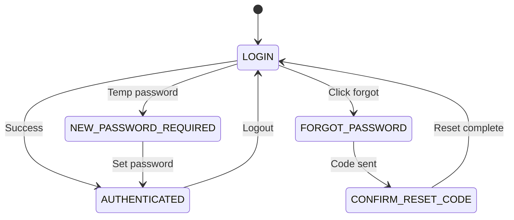
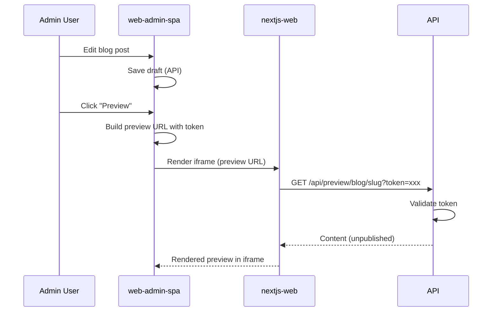

# Web Admin SPA Plan

**Grounded to:** Website Modernization ($4,000 - admin features) + Newsletter/Email Capture ($450)

An admin dashboard for managing website content, email subscribers, and viewing analytics. This is a React SPA used by FCA staff to manage the public website.

---

## Contract Deliverables Checklist

### Website Modernization (Admin Features)
| Deliverable | Status | Notes |
|-------------|--------|-------|
| Admin dashboard for managing tombstones and blog posts | Planned | Content management CRUD |
| Analytics dashboard for tracking page visits and content performance | Planned | Hourly granularity charts |
| Documentation for internal staff on self-service content management | Planned | In-app help + README |

### Newsletter/Email Capture
| Deliverable | Status | Notes |
|-------------|--------|-------|
| Seller intake forms for capturing inbound leads through the website | API Support | Forms on nextjs-web, managed here |
| Integration with Company's email marketing platform | Planned | Resend API integration |
| Automated email notifications when new tombstones or blog posts are published | Planned | Toggle + preview before send |

---

## Tech Stack

| Layer | Technology |
|-------|------------|
| Framework | React 18 + TypeScript |
| Build Tool | Vite |
| Routing | React Router v6 |
| Data Fetching | TanStack Query (React Query) |
| UI Components | shadcn/ui (New York style, dark mode) |
| Styling | Tailwind CSS |
| Forms | react-hook-form + zod |
| Charts | Recharts |
| **Rich Text Editor** | **BlockNote** (outputs Markdown) |
| Auth | AWS Amplify (Cognito) - with mock support |

---

## Shared Design System

> **CRITICAL**: This SPA shares the exact same design system as `lead-gen-spa` to ensure brand consistency.

### Aesthetic
Luxury, high-tech, enterprise, sleek. **Dark mode only.**

### Color Palette (CSS Variables)

```css
/* globals.css - MUST match lead-gen-spa exactly */

/* Dark mode primary - sophisticated dark background */
--background: 224 71% 4%;        /* Near black with blue undertone */
--foreground: 213 31% 91%;       /* Soft white */

/* Card/Surface - subtle elevation */
--card: 224 71% 6%;              /* Slightly lighter than bg */
--card-foreground: 213 31% 91%;

/* Muted - for secondary text */
--muted: 223 47% 11%;
--muted-foreground: 215 20% 65%;

/* Accent - electric blue */
--primary: 217 91% 60%;          /* Electric blue */
--primary-foreground: 210 40% 98%;

/* Success */
--success: 142 76% 36%;          /* Green */

/* Warning */
--warning: 38 92% 50%;           /* Amber */

/* Destructive */
--destructive: 0 84% 60%;        /* Red */

/* Border - subtle dividers */
--border: 216 34% 17%;
--ring: 217 91% 60%;
```

### Typography

```css
/* Primary font - clean, modern sans-serif */
font-family: 'Inter', system-ui, sans-serif;

/* Monospace for data/metrics */
font-family: 'JetBrains Mono', 'Fira Code', monospace;
```

| Element | Size | Weight | Tracking |
|---------|------|--------|----------|
| Page Title | 2rem (32px) | 600 | -0.02em |
| Section Header | 1.25rem (20px) | 600 | -0.01em |
| Card Title | 1rem (16px) | 500 | 0 |
| Body | 0.875rem (14px) | 400 | 0 |
| Small/Label | 0.75rem (12px) | 500 | 0.05em |
| Metric Large | 2.5rem (40px) | 700 | -0.02em |

### Visual Elements

**Cards:**
- Subtle border (1px, --border color)
- Very slight background elevation
- No heavy shadows
- Border radius: 12px

**Buttons:**
- Primary: Solid accent color, slight glow on hover
- Secondary: Ghost style with border
- Rounded-lg (8px radius)
- Smooth 150ms transitions

**Tables:**
- Alternating row colors (very subtle)
- Hover state with accent color tint
- Sticky header with blur background
- Compact row height for data density

**Charts (Recharts):**
- Gradient fills (accent color fading to transparent)
- Thin, crisp lines (2px stroke)
- Subtle grid lines (--border color)
- Animated on mount
- Tooltip with glass morphism effect

### Layout: Persistent Sidebar

The sidebar is **always visible** and **pushes content** to the right. It does NOT overlay.

```
┌─────────────────────┬──────────────────────────────────────────────────────┐
│  ◆ FCA Admin        │                                                      │
│                     │              MAIN CONTENT AREA                       │
│  Dashboard          │                                                      │
│  Tombstones         │   Content is pushed right to make room for sidebar   │
│  Blog Posts         │                                                      │
│  Pages              │              (Never hidden behind sidebar)           │
│  ─────────────────  │                                                      │
│  Analytics          │                                                      │
│  Subscribers        │                                                      │
│  Intakes            │                                                      │
│  ─────────────────  │                                                      │
│  Settings           │                                                      │
│                     │                                                      │
│  ─────────────────  │                                                      │
│  👤 John Smith      │                                                      │
│     admin           │                                                      │
└─────────────────────┴──────────────────────────────────────────────────────┘
       240px fixed                    flex-1 (remaining width)
```

**Layout CSS (Same as lead-gen-spa):**
```css
.app-layout {
  display: flex;
  min-height: 100vh;
}

.sidebar {
  width: 240px;
  flex-shrink: 0;        /* Never shrink */
  position: sticky;      /* Stays in place on scroll */
  top: 0;
  height: 100vh;
  overflow-y: auto;
}

.main-content {
  flex: 1;               /* Takes remaining width */
  min-width: 0;          /* Allows content to shrink properly */
  overflow-x: hidden;
}
```

### Tailwind Config

```typescript
// tailwind.config.ts - MUST match lead-gen-spa exactly
export default {
  darkMode: 'class',
  theme: {
    extend: {
      colors: {
        electric: {
          50: '#eff6ff',
          100: '#dbeafe',
          500: '#3b82f6',
          600: '#2563eb',
        },
      },
      fontFamily: {
        sans: ['Inter', 'system-ui', 'sans-serif'],
        mono: ['JetBrains Mono', 'Fira Code', 'monospace'],
      },
      animation: {
        'glow': 'glow 2s ease-in-out infinite alternate',
        'fade-in': 'fadeIn 0.5s ease-out',
      },
      keyframes: {
        glow: {
          '0%': { boxShadow: '0 0 5px rgba(59, 130, 246, 0.5)' },
          '100%': { boxShadow: '0 0 20px rgba(59, 130, 246, 0.8)' },
        },
        fadeIn: {
          '0%': { opacity: '0', transform: 'translateY(10px)' },
          '100%': { opacity: '1', transform: 'translateY(0)' },
        },
      },
    },
  },
};
```

---

## Authentication Flow

> **CRITICAL**: Authentication follows the exact same pattern as `lead-gen-spa` for consistency.

### Auth Flow State Machine



### Auth Flows Supported

| Flow | Trigger | Outcome |
|------|---------|---------|
| **Normal Login** | Email + password | Authenticated |
| **New Password Required** | First login with temp password | Must set new password |
| **Forgot Password** | Click "Forgot password?" | Enter email, receive code |
| **Confirm Reset Code** | Enter code + new password | Password reset, back to login |

### Mock Auth Configuration

```typescript
// lib/amplify-config.ts
export const USE_MOCK_AUTH = true;  // Toggle for development

export const DEMO_CREDENTIALS = {
  email: 'admin@flatironscapital.com',
  password: 'admin123',
};
```

When `USE_MOCK_AUTH` is true:
- Demo credentials shown on login screen
- All auth operations simulated in-memory
- No Cognito calls made

### Switching to Real Cognito

1. Set environment variables:
   - `VITE_COGNITO_USER_POOL_ID`
   - `VITE_COGNITO_CLIENT_ID`
   - `VITE_COGNITO_DOMAIN`
2. Set `USE_MOCK_AUTH = false` in `amplify-config.ts`
3. Install `aws-amplify` package
4. Uncomment `Amplify.configure()` in `main.tsx`

### Auth Types (Shared with lead-gen-spa)

```typescript
// types/auth.ts
export type SignInStep = 
  | 'DONE'
  | 'CONFIRM_SIGN_IN_WITH_NEW_PASSWORD_REQUIRED'
  | 'RESET_PASSWORD';

export type AuthFlow = 
  | 'LOGIN'
  | 'NEW_PASSWORD_REQUIRED'
  | 'FORGOT_PASSWORD'
  | 'CONFIRM_RESET_CODE';

export interface SignInResult {
  isSignedIn: boolean;
  user?: User;
  nextStep?: SignInStep;
  codeDeliveryDetails?: {
    destination?: string;
    deliveryMedium?: string;
  };
}

export interface AuthState {
  user: User | null;
  isAuthenticated: boolean;
}
```

### Auth Context

```typescript
// contexts/AuthContext.tsx
interface AuthContextValue extends AuthState {
  authFlow: AuthFlow;
  pendingEmail: string | null;
  resetCodeDestination: string | null;
  isLoading: boolean;
  
  // Actions
  login: (email: string, password: string) => Promise<SignInResult>;
  confirmNewPassword: (newPassword: string) => Promise<SignInResult>;
  forgotPassword: (email: string) => Promise<void>;
  confirmResetPassword: (code: string, newPassword: string) => Promise<void>;
  startForgotPasswordFlow: () => void;
  cancelAuthFlow: () => void;
  signOut: () => Promise<void>;
}
```

### Login Page

The login page renders different forms based on `authFlow`:
- `LOGIN`: Email + password form with demo credentials banner
- `NEW_PASSWORD_REQUIRED`: New password form
- `FORGOT_PASSWORD`: Email input to send reset code
- `CONFIRM_RESET_CODE`: Code + new password form

---

## TypeScript Types

> **CRITICAL**: Types MUST match the Prisma schema in `src/api/PLAN.md` exactly.

```typescript
// types/index.ts

// ===========================================
// CORE MODELS (from API schema)
// ===========================================

export interface Tombstone {
  id: string;
  name: string;
  slug: string;
  imagePath: string;
  industry: string | null;
  role: string | null;
  dealDate: string | null;
  description: string | null;
  newsSlug: string | null;
  sortOrder: number;
  isPublished: boolean;
  previewToken: string;
  createdAt: string;
  updatedAt: string;
}

export interface BlogPost {
  id: string;
  slug: string;
  title: string;
  excerpt: string | null;
  content: string;           // Markdown content (from BlockNote)
  author: string | null;
  category: string | null;   // news, resource, article
  publishedAt: string | null;
  isPublished: boolean;
  previewToken: string;
  createdAt: string;
  updatedAt: string;
}

export interface PageContent {
  id: string;
  pageKey: string;           // about, faq, contact, etc.
  title: string;
  content: string;           // Markdown or JSON
  metadata: Record<string, unknown> | null;  // SEO metadata
  previewToken: string;
  updatedAt: string;
}

export interface PageView {
  id: string;
  path: string;
  hour: string;              // ISO timestamp truncated to hour
  count: number;
  createdAt: string;
}

export interface EmailSubscriber {
  id: string;
  email: string;
  name: string | null;
  source: string | null;     // website, intake_form, manual
  isSubscribed: boolean;
  subscribedAt: string;
  unsubscribedAt: string | null;
}

export interface SellerIntake {
  id: string;
  email: string;
  name: string | null;
  companyName: string | null;
  phone: string | null;
  message: string | null;
  source: string | null;
  status: 'new' | 'contacted' | 'qualified' | 'closed';
  createdAt: string;
  updatedAt: string;
}

export interface EmailNotification {
  id: string;
  type: 'new_tombstone' | 'new_blog_post';
  referenceId: string;
  sentAt: string;
  recipientCount: number;
}

// ===========================================
// USER & AUTH (shared with lead-gen-spa)
// ===========================================

export type UserRole = 'readonly' | 'readwrite' | 'admin';

export interface User {
  id: string;
  email: string;
  name: string | null;
  cognitoSub: string | null;
  organizationId: string | null;
  role: UserRole;
  invitedAt: string;
  lastActiveAt: string | null;
  createdAt: string;
  updatedAt: string;
}

// ===========================================
// INPUT TYPES (for forms)
// ===========================================

export interface CreateTombstoneInput {
  name: string;
  slug?: string;             // Auto-generated if not provided
  imagePath: string;
  industry?: string;
  role?: string;
  dealDate?: string;
  description?: string;
  newsSlug?: string;
  sortOrder?: number;
  isPublished?: boolean;
}

export interface UpdateTombstoneInput extends Partial<CreateTombstoneInput> {}

export interface CreateBlogPostInput {
  slug?: string;             // Auto-generated from title if not provided
  title: string;
  excerpt?: string;
  content: string;           // Markdown
  author?: string;
  category?: string;
  isPublished?: boolean;
}

export interface UpdateBlogPostInput extends Partial<CreateBlogPostInput> {}

export interface UpdatePageContentInput {
  title?: string;
  content?: string;
  metadata?: Record<string, unknown>;
}

export interface CreateSubscriberInput {
  email: string;
  name?: string;
  source?: string;
}

export interface UpdateIntakeStatusInput {
  status: 'new' | 'contacted' | 'qualified' | 'closed';
  notes?: string;
}

export interface SendEmailInput {
  subject: string;
  htmlContent: string;
  recipientFilter?: {
    subscribedOnly?: boolean;
    sources?: string[];
  };
  testEmail?: string;        // Send test to this email first
}

// ===========================================
// ANALYTICS TYPES
// ===========================================

export interface DashboardStats {
  totalTombstones: number;
  totalBlogPosts: number;
  totalSubscribers: number;
  intakesThisWeek: number;
}

export interface AnalyticsParams {
  start: string;             // ISO date
  end: string;               // ISO date
  granularity?: 'hour' | 'day';
}

export interface PageViewData {
  timestamp: string;
  count: number;
}

export interface TopPage {
  path: string;
  views: number;
  title?: string;
}

// ===========================================
// PAGINATED RESPONSE
// ===========================================

export interface PaginatedResponse<T> {
  data: T[];
  total: number;
  page: number;
  limit: number;
  totalPages: number;
}
```

---

## Application Structure

```
src/
├── main.tsx                    # Entry point + Amplify config
├── App.tsx                     # Root component with providers + routes
├── assets/
│   └── logo.png                # FCA mountain logo (use brightness-0 invert for white)
├── pages/
│   ├── Login.tsx               # Login with all auth flows
│   ├── Dashboard.tsx           # Overview stats
│   ├── Tombstones.tsx          # Tombstone list
│   ├── TombstoneForm.tsx       # Create/edit tombstone
│   ├── BlogPosts.tsx           # Blog post list
│   ├── BlogPostForm.tsx        # Create/edit blog post
│   ├── PageContent.tsx         # Edit static page content
│   ├── Analytics.tsx           # Page view analytics
│   ├── Subscribers.tsx         # Email subscriber management
│   ├── SellerIntakes.tsx       # Seller intake submissions
│   ├── EmailCompose.tsx        # Compose and send emails
│   └── Settings.tsx            # User settings
├── components/
│   ├── layout/
│   │   ├── Sidebar.tsx         # 240px persistent sidebar
│   │   ├── Header.tsx
│   │   └── PageContainer.tsx
│   ├── tombstones/
│   │   ├── TombstoneTable.tsx
│   │   ├── TombstoneCard.tsx
│   │   └── ImageUploader.tsx
│   ├── blog/
│   │   ├── BlogPostTable.tsx
│   │   ├── BlockNoteEditor.tsx    # BlockNote WYSIWYG editor
│   │   └── MarkdownPreview.tsx    # Rendered markdown preview
│   ├── preview/
│   │   └── PreviewIframe.tsx      # Iframe to show live website preview
│   ├── analytics/
│   │   ├── PageViewChart.tsx
│   │   ├── TopPagesTable.tsx
│   │   └── DateRangePicker.tsx
│   ├── email/
│   │   ├── SubscriberTable.tsx
│   │   ├── EmailPreview.tsx
│   │   └── RecipientSelector.tsx
│   └── ui/                     # shadcn/ui components (same as lead-gen-spa)
├── lib/
│   ├── amplify-config.ts       # Cognito config + USE_MOCK_AUTH toggle
│   ├── auth.ts                 # Auth functions (login, logout, reset, etc.)
│   ├── api/
│   │   ├── types.ts            # WebAdminApi interface
│   │   ├── mock.ts             # Mock implementation
│   │   ├── real.ts             # Real API implementation (future)
│   │   └── index.ts            # Export current api
│   └── utils.ts                # Utility functions (cn, formatDate, etc.)
├── hooks/
│   ├── useAuth.ts              # Re-export from context
│   ├── useTombstones.ts
│   ├── useBlogPosts.ts
│   ├── useAnalytics.ts
│   ├── useSubscribers.ts
│   └── useIntakes.ts
├── contexts/
│   └── AuthContext.tsx         # Auth state machine (same pattern as lead-gen-spa)
└── types/
    └── index.ts                # TypeScript types (matching API schema)
```

---

## API Client Architecture

> **CRITICAL**: Same modular API pattern as `lead-gen-spa` for easy mock-to-real switching.

### API Interface

```typescript
// lib/api/types.ts
export interface WebAdminApi {
  // Dashboard
  getDashboardStats(): Promise<DashboardStats>;
  getRecentActivity(): Promise<ActivityItem[]>;
  
  // Tombstones
  getTombstones(): Promise<Tombstone[]>;
  getTombstone(id: string): Promise<Tombstone>;
  createTombstone(input: CreateTombstoneInput): Promise<Tombstone>;
  updateTombstone(id: string, input: UpdateTombstoneInput): Promise<Tombstone>;
  deleteTombstone(id: string): Promise<void>;
  publishTombstone(id: string, isPublished: boolean): Promise<Tombstone>;
  reorderTombstones(ids: string[]): Promise<void>;
  
  // Blog Posts
  getBlogPosts(): Promise<BlogPost[]>;
  getBlogPost(id: string): Promise<BlogPost>;
  createBlogPost(input: CreateBlogPostInput): Promise<BlogPost>;
  updateBlogPost(id: string, input: UpdateBlogPostInput): Promise<BlogPost>;
  deleteBlogPost(id: string): Promise<void>;
  publishBlogPost(id: string, isPublished: boolean): Promise<BlogPost>;
  
  // Page Content
  getPages(): Promise<PageContent[]>;
  getPage(pageKey: string): Promise<PageContent>;
  updatePage(pageKey: string, input: UpdatePageContentInput): Promise<PageContent>;
  
  // Analytics
  getPageViews(params: AnalyticsParams): Promise<PageViewData[]>;
  getTopPages(params: AnalyticsParams & { limit?: number }): Promise<TopPage[]>;
  
  // Subscribers
  getSubscribers(): Promise<EmailSubscriber[]>;
  createSubscriber(input: CreateSubscriberInput): Promise<EmailSubscriber>;
  deleteSubscriber(id: string): Promise<void>;
  exportSubscribers(): Promise<Blob>;
  importSubscribers(file: File): Promise<{ imported: number; skipped: number }>;
  
  // Seller Intakes
  getIntakes(): Promise<SellerIntake[]>;
  getIntake(id: string): Promise<SellerIntake>;
  updateIntakeStatus(id: string, input: UpdateIntakeStatusInput): Promise<SellerIntake>;
  exportIntakes(): Promise<Blob>;
  
  // Email
  sendEmail(input: SendEmailInput): Promise<{ sent: number }>;
  previewEmail(input: SendEmailInput): Promise<{ html: string }>;
  getEmailHistory(): Promise<EmailNotification[]>;
}
```

### Mock Implementation

```typescript
// lib/api/mock.ts
import { WebAdminApi } from './types';
import { mockData } from '../mock-data';

export const mockApi: WebAdminApi = {
  async getDashboardStats() {
    await delay(200);
    return {
      totalTombstones: mockData.tombstones.length,
      totalBlogPosts: mockData.blogPosts.length,
      totalSubscribers: mockData.subscribers.filter(s => s.isSubscribed).length,
      intakesThisWeek: mockData.intakes.filter(i => isThisWeek(i.createdAt)).length,
    };
  },
  // ... other methods
};

function delay(ms: number) {
  return new Promise(resolve => setTimeout(resolve, ms));
}
```

### API Export

```typescript
// lib/api/index.ts
import { mockApi } from './mock';
// import { realApi } from './real';  // Uncomment when API is ready

// Switch this when backend is ready
export const api = mockApi;
// export const api = realApi;
```

---

## Page Specifications

### 1. Dashboard (`/`)

Overview of key metrics and recent activity.

**Components:**
- Stats cards: Total tombstones, total blog posts, total subscribers, intakes this week
- Recent activity: Last 5 content updates
- Quick actions: Add tombstone, Add blog post, View analytics

**API Calls:**
- `GET /api/admin/stats`

---

### 2. Tombstones (`/tombstones`)

Manage transaction tombstones displayed on the website.

**Features:**
- Table view with columns: Image, Name, Industry, Role, Date, Status
- Filters: Published/Draft, Industry, Role
- Sort: By date, name, or custom order
- Actions: Edit, Delete, Publish/Unpublish, Reorder

**CRUD Operations:**
- Create: Upload image, enter metadata, set industry/role cross-links
- Edit: Update any field, replace image
- Delete: Soft delete with confirmation
- Publish: Toggle visibility on public site

**API Calls:**
- `GET /api/admin/tombstones`
- `POST /api/admin/tombstones`
- `PUT /api/admin/tombstones/:id`
- `DELETE /api/admin/tombstones/:id`
- `POST /api/admin/tombstones/:id/publish`

---

### 3. Blog Posts (`/blog-posts`)

Manage news articles and resource articles.

**Features:**
- Table view with columns: Title, Category, Author, Published Date, Status
- Filters: Category (news/resource), Published/Draft
- **BlockNote WYSIWYG editor** with live markdown preview
- SEO metadata editor (title, description, keywords)

**CRUD Operations:**
- Create: Write content in BlockNote, set category, add metadata
- Edit: Update content and metadata
- Delete: Soft delete with confirmation
- Publish: Set publish date and toggle visibility

**Editor Workflow:**
1. User writes content in BlockNote (rich WYSIWYG experience)
2. On change, `blocksToMarkdownLossy()` converts to markdown
3. Markdown stored in database (`content` field)
4. On load, `tryParseMarkdownToBlocks()` converts back to blocks

**API Calls:**
- `GET /api/admin/blog-posts`
- `POST /api/admin/blog-posts`
- `PUT /api/admin/blog-posts/:id`
- `DELETE /api/admin/blog-posts/:id`
- `POST /api/admin/blog-posts/:id/publish`

---

### 4. Page Content (`/pages`)

Edit static page content (About, FAQ, Contact, etc.).

**Features:**
- List of editable pages
- Markdown editor for content
- JSON editor for structured data (FAQ items, team members)
- Preview before save

**Pages:**
- About
- FAQ (structured Q&A)
- Contact
- Buy-side
- Team (structured member list)
- Privacy Policy

**API Calls:**
- `GET /api/admin/pages`
- `PUT /api/admin/pages/:pageKey`

---

## Live Preview System

Admin users can preview unpublished content exactly as it will appear on the website using an embedded iframe.

### How It Works



### Preview URL Structure

Each content record has a `previewToken` (UUID) that enables preview access:

```
https://www.flatironscapitaladvisors.com/preview/news/my-article?token=abc123-def456-...
```

- Token is generated when content is created
- Token remains stable during edits (preview URL doesn't change)
- Token validates access to unpublished content

### PreviewIframe Component

```typescript
// components/preview/PreviewIframe.tsx
interface PreviewIframeProps {
  contentType: 'tombstone' | 'blog-post' | 'page';
  slug: string;
  previewToken: string;
  className?: string;
}

export function PreviewIframe({ 
  contentType, 
  slug, 
  previewToken,
  className 
}: PreviewIframeProps) {
  const baseUrl = import.meta.env.VITE_WEBSITE_URL;
  
  // Map content types to preview routes
  const previewPath = {
    'tombstone': `/preview/transactions/${slug}`,
    'blog-post': `/preview/news/${slug}`, // or /preview/resources/ based on category
    'page': `/preview/${slug}`,
  }[contentType];
  
  const previewUrl = `${baseUrl}${previewPath}?token=${previewToken}`;
  
  return (
    <div className={cn("border rounded-lg overflow-hidden", className)}>
      <div className="bg-muted px-3 py-2 text-sm flex items-center justify-between">
        <span className="text-muted-foreground">Live Preview</span>
        <Button 
          variant="ghost" 
          size="sm"
          onClick={() => window.open(previewUrl, '_blank')}
        >
          Open in new tab
        </Button>
      </div>
      <iframe
        src={previewUrl}
        className="w-full h-[600px] bg-white"
        title="Content Preview"
      />
    </div>
  );
}
```

### Security Notes

- Preview URLs only work when loaded in an iframe (Next.js checks `Sec-Fetch-Dest` header)
- Preview routes return `noindex, nofollow` to prevent search engine indexing
- Tokens are UUIDs (122 bits entropy) - impossible to guess
- Opening preview in new tab will show an error message (iframe-only protection)

---

### 5. Analytics (`/analytics`)

View website traffic and content performance.

**Features:**
- Date range picker (last 7 days, 30 days, 90 days, custom)
- **Hourly granularity** as specified in contract
- Page view chart (line/bar)
- Top pages table with view counts
- Content performance: Which tombstones/posts get most views
- Export to CSV

**Charts:**
- Total page views over time (hourly/daily)
- Views by page category
- Top 10 most viewed pages
- Trend comparison (this period vs previous)

**API Calls:**
- `GET /api/admin/analytics/pageviews?start=&end=&granularity=hour`
- `GET /api/admin/analytics/top-pages?start=&end=&limit=10`
- `GET /api/admin/analytics/trends?start=&end=`

---

### 6. Email Subscribers (`/subscribers`)

Manage newsletter email list (Resend integration).

**Features:**
- Table view: Email, Name, Source, Subscribed Date, Status
- Filters: Subscribed/Unsubscribed, Source
- Add subscriber manually
- Remove/unsubscribe
- Export subscriber list
- Bulk import (CSV)

**API Calls:**
- `GET /api/admin/subscribers`
- `POST /api/admin/subscribers`
- `DELETE /api/admin/subscribers/:id`
- `GET /api/admin/subscribers/export`
- `POST /api/admin/subscribers/import`

---

### 7. Seller Intakes (`/intakes`)

View and manage seller intake form submissions.

**Features:**
- Table view: Name, Company, Email, Phone, Date, Status
- Status workflow: New → Contacted → Qualified → Closed
- View full message/details
- Add notes
- Export to CSV

**API Calls:**
- `GET /api/admin/seller-intakes`
- `PUT /api/admin/seller-intakes/:id`
- `GET /api/admin/seller-intakes/export`

---

### 8. Email Compose (`/email/compose`)

Send emails to subscribers (Resend integration).

**Features:**
- Recipient selection: All subscribers, filtered list
- Subject line input
- Rich text / HTML editor
- **Automated notification toggle**: Auto-send when new content published
- Preview email before sending
- Send test email to self
- Track send history

**Automated Notifications (Contract Requirement):**
- Toggle: "Notify subscribers when this is published"
- On tombstone/blog publish, if toggled, queue email
- Template: "[New Transaction] {name}" or "[New Article] {title}"
- Preview template before enabling

**API Calls:**
- `POST /api/admin/email/send`
- `POST /api/admin/email/preview`
- `GET /api/admin/email/history`

---

### 9. Settings (`/settings`)

User preferences and app configuration.

**Features:**
- User profile (name, email)
- Notification preferences
- Email template defaults
- View API usage

---

## BlockNote Editor Integration

### Why BlockNote + Markdown?

| Benefit | Description |
|---------|-------------|
| **User Experience** | WYSIWYG editing is easier for non-technical staff |
| **Storage Format** | Markdown is portable, readable, and compatible with existing content |
| **Rendering** | Next.js can render markdown server-side for SEO |
| **Migration** | Existing markdown files migrate directly to database |

### Installation

```bash
npm install @blocknote/core @blocknote/react @blocknote/mantine
```

### Editor Component

```typescript
// components/blog/BlockNoteEditor.tsx
import "@blocknote/core/fonts/inter.css";
import "@blocknote/mantine/style.css";
import { BlockNoteView } from "@blocknote/mantine";
import { useCreateBlockNote } from "@blocknote/react";
import { useEffect, useState } from "react";

interface BlockNoteEditorProps {
  initialMarkdown?: string;
  onChange: (markdown: string) => void;
}

export function BlockNoteEditor({ initialMarkdown, onChange }: BlockNoteEditorProps) {
  const [isReady, setIsReady] = useState(false);
  
  const editor = useCreateBlockNote();

  // Load initial markdown content
  useEffect(() => {
    if (initialMarkdown && editor) {
      const loadContent = async () => {
        const blocks = await editor.tryParseMarkdownToBlocks(initialMarkdown);
        editor.replaceBlocks(editor.document, blocks);
        setIsReady(true);
      };
      loadContent();
    } else {
      setIsReady(true);
    }
  }, [initialMarkdown, editor]);

  // Convert to markdown on change
  const handleChange = async () => {
    const markdown = await editor.blocksToMarkdownLossy(editor.document);
    onChange(markdown);
  };

  if (!isReady) {
    return <div className="h-64 animate-pulse bg-muted rounded-md" />;
  }

  return (
    <BlockNoteView 
      editor={editor} 
      onChange={handleChange}
      theme="dark"  // Match our dark mode design system
    />
  );
}
```

### Supported Content Types

BlockNote → Markdown supports:
- Headings (H1-H3)
- Paragraphs
- Bold, italic, underline, strikethrough
- Links
- Bullet lists and numbered lists
- Code blocks
- Block quotes
- Images (with URL)

**Note:** Some advanced BlockNote features (tables, custom blocks) may not convert perfectly to markdown. For blog posts and news articles, the standard content types above are sufficient.

---

## Implementation Checklist

### Phase 1: Project Setup
- [ ] Initialize Vite + React + TypeScript project
- [ ] Configure Tailwind CSS (matching lead-gen-spa exactly)
- [ ] Install and configure shadcn/ui (New York, dark mode)
- [ ] Set up React Router
- [ ] Configure TanStack Query
- [ ] Copy shared design system files from lead-gen-spa

### Phase 2: Authentication
- [ ] Create `amplify-config.ts` with mock toggle
- [ ] Create `auth.ts` with auth functions (matching lead-gen-spa pattern)
- [ ] Create AuthContext with state machine
- [ ] Create Login page with all flows
- [ ] Add protected route wrapper

### Phase 3: Layout & Navigation
- [ ] Create sidebar navigation (240px, persistent)
- [ ] Create header with user menu
- [ ] Create page container component
- [ ] Add responsive breakpoints

### Phase 4: Content Management
- [ ] Tombstones list page
- [ ] Tombstone create/edit form with image upload
- [ ] Blog posts list page
- [ ] Blog post editor with BlockNote (markdown output)
- [ ] Page content editor with BlockNote
- [ ] PreviewIframe component for live previews
- [ ] Preview toggle in all content editors

### Phase 5: Analytics Dashboard
- [ ] Date range picker component
- [ ] Page view chart (hourly granularity)
- [ ] Top pages table
- [ ] Content performance metrics
- [ ] Export functionality

### Phase 6: Email Management
- [ ] Subscriber list with filters
- [ ] Add/remove subscribers
- [ ] Import/export CSV
- [ ] Email compose with preview
- [ ] Automated notification toggle on publish

### Phase 7: Seller Intakes
- [ ] Intake list with status workflow
- [ ] Detail view with notes
- [ ] Status update actions
- [ ] Export functionality

### Phase 8: Polish
- [ ] Loading states and skeletons
- [ ] Error handling and toast notifications
- [ ] Confirmation dialogs
- [ ] Help tooltips and documentation links

---

## Cross-Platform Consistency Notes

### Shared with lead-gen-spa

| Asset | Location | Notes |
|-------|----------|-------|
| Design system | CSS variables, Tailwind config | Copy exactly |
| Auth pattern | AuthContext, auth.ts, Login.tsx | Same state machine |
| Layout | Sidebar (240px), flex layout | Same structure |
| shadcn/ui components | components/ui/ | Same config |
| Logo | `src/assets/logo.png` | Use `brightness-0 invert` for white version |

### Logo Usage

The logo asset is pre-staged at `web-admin-spa/assets/logo.png`. During project scaffolding, copy it to `src/assets/logo.png`.

```bash
# During scaffolding
mkdir -p src/assets
cp assets/logo.png src/assets/
```

In the Sidebar and Login page, apply CSS filters to make it white on dark background:

```tsx
// In Sidebar.tsx and Login.tsx
import logo from '@/assets/logo.png';


```

The logo is blue (#3b5998) on transparent - the `brightness-0 invert` filter converts it to white for the dark theme.

### API Types Alignment

Both SPAs use types derived from `src/api/PLAN.md`:
- `User` with `role: 'readonly' | 'readwrite' | 'admin'`
- Timestamps as ISO strings
- IDs as UUID strings

---

## Deployment

### Docker Configuration
- Vite build produces static assets
- Serve via nginx or Next.js static export
- Environment variables at build time

### CDK Integration
- S3 bucket for static assets
- CloudFront distribution
- Custom domain with SSL
