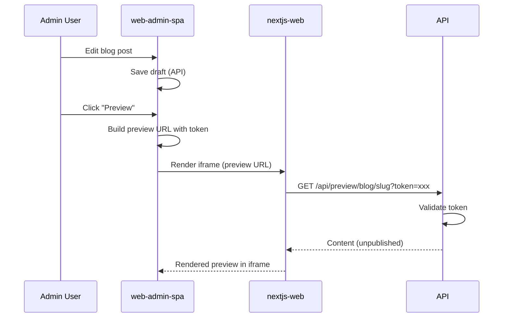
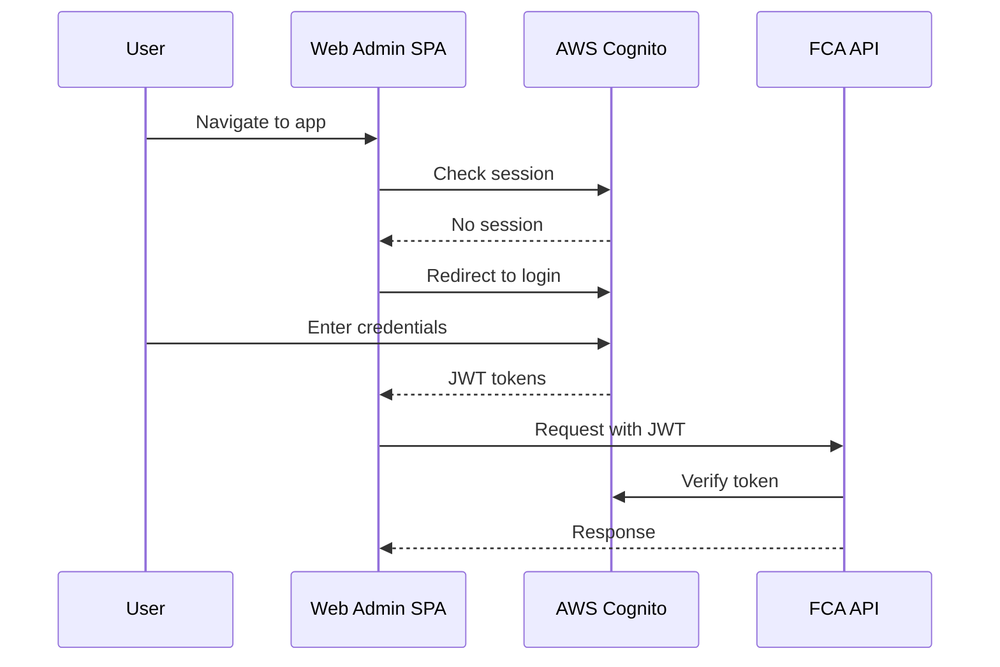

# Web Admin SPA Plan

**Grounded to:** Website Modernization ($4,000 - admin features) + Newsletter/Email Capture ($450)

An admin dashboard for managing website content, email subscribers, and viewing analytics. This is a React SPA used by FCA staff to manage the public website.

---

## Contract Deliverables Checklist

### Website Modernization (Admin Features)
| Deliverable | Status | Notes |
|-------------|--------|-------|
| Admin dashboard for managing tombstones and blog posts | Planned | Content management CRUD |
| Analytics dashboard for tracking page visits and content performance | Planned | Hourly granularity charts |
| Documentation for internal staff on self-service content management | Planned | In-app help + README |

### Newsletter/Email Capture
| Deliverable | Status | Notes |
|-------------|--------|-------|
| Seller intake forms for capturing inbound leads through the website | API Support | Forms on nextjs-web, managed here |
| Integration with Company's email marketing platform | Planned | Resend API integration |
| Automated email notifications when new tombstones or blog posts are published | Planned | Toggle + preview before send |

---

## Tech Stack

| Layer | Technology |
|-------|------------|
| Framework | React 18 + TypeScript |
| Build Tool | Vite |
| Routing | React Router v6 |
| Data Fetching | TanStack Query (React Query) |
| UI Components | shadcn/ui |
| Styling | Tailwind CSS |
| Forms | react-hook-form + zod |
| Charts | Recharts |
| **Rich Text Editor** | **BlockNote** (outputs Markdown) |
| Auth | AWS Amplify (Cognito) |

---

## Application Structure

```
src/
├── main.tsx                    # Entry point
├── App.tsx                     # Root component with providers
├── routes.tsx                  # Route definitions
├── pages/
│   ├── Dashboard.tsx           # Overview stats
│   ├── Tombstones.tsx          # Tombstone list
│   ├── TombstoneForm.tsx       # Create/edit tombstone
│   ├── BlogPosts.tsx           # Blog post list
│   ├── BlogPostForm.tsx        # Create/edit blog post
│   ├── PageContent.tsx         # Edit static page content
│   ├── Analytics.tsx           # Page view analytics
│   ├── Subscribers.tsx         # Email subscriber management
│   ├── SellerIntakes.tsx       # Seller intake submissions
│   ├── EmailCompose.tsx        # Compose and send emails
│   └── Settings.tsx            # User settings
├── components/
│   ├── layout/
│   │   ├── Sidebar.tsx
│   │   ├── Header.tsx
│   │   └── PageContainer.tsx
│   ├── tombstones/
│   │   ├── TombstoneTable.tsx
│   │   ├── TombstoneCard.tsx
│   │   └── ImageUploader.tsx
│   ├── blog/
│   │   ├── BlogPostTable.tsx
│   │   ├── BlockNoteEditor.tsx    # BlockNote WYSIWYG editor
│   │   └── MarkdownPreview.tsx    # Rendered markdown preview
│   ├── preview/
│   │   └── PreviewIframe.tsx      # Iframe to show live website preview
│   ├── analytics/
│   │   ├── PageViewChart.tsx
│   │   ├── TopPagesTable.tsx
│   │   └── DateRangePicker.tsx
│   ├── email/
│   │   ├── SubscriberTable.tsx
│   │   ├── EmailPreview.tsx
│   │   └── RecipientSelector.tsx
│   └── ui/                     # shadcn/ui components
├── lib/
│   ├── api.ts                  # API client
│   ├── auth.ts                 # Cognito auth helpers
│   └── utils.ts                # Utility functions
├── hooks/
│   ├── useAuth.ts
│   ├── useTombstones.ts
│   ├── useBlogPosts.ts
│   ├── useAnalytics.ts
│   └── useSubscribers.ts
├── contexts/
│   ├── AuthContext.tsx
│   └── ThemeContext.tsx
└── types/
    └── index.ts                # TypeScript types
```

---

## Page Specifications

### 1. Dashboard (`/`)

Overview of key metrics and recent activity.

**Components:**
- Stats cards: Total tombstones, total blog posts, total subscribers, intakes this week
- Recent activity: Last 5 content updates
- Quick actions: Add tombstone, Add blog post, View analytics

**API Calls:**
- `GET /api/admin/stats`

---

### 2. Tombstones (`/tombstones`)

Manage transaction tombstones displayed on the website.

**Features:**
- Table view with columns: Image, Name, Industry, Role, Date, Status
- Filters: Published/Draft, Industry, Role
- Sort: By date, name, or custom order
- Actions: Edit, Delete, Publish/Unpublish, Reorder

**CRUD Operations:**
- Create: Upload image, enter metadata, set industry/role cross-links
- Edit: Update any field, replace image
- Delete: Soft delete with confirmation
- Publish: Toggle visibility on public site

**API Calls:**
- `GET /api/admin/tombstones`
- `POST /api/admin/tombstones`
- `PUT /api/admin/tombstones/:id`
- `DELETE /api/admin/tombstones/:id`
- `POST /api/admin/tombstones/:id/publish`

---

### 3. Blog Posts (`/blog-posts`)

Manage news articles and resource articles.

**Features:**
- Table view with columns: Title, Category, Author, Published Date, Status
- Filters: Category (news/resource), Published/Draft
- **BlockNote WYSIWYG editor** with live markdown preview
- SEO metadata editor (title, description, keywords)

**CRUD Operations:**
- Create: Write content in BlockNote, set category, add metadata
- Edit: Update content and metadata
- Delete: Soft delete with confirmation
- Publish: Set publish date and toggle visibility

**Editor Workflow:**
1. User writes content in BlockNote (rich WYSIWYG experience)
2. On change, `blocksToMarkdownLossy()` converts to markdown
3. Markdown stored in database (`content` field)
4. On load, `tryParseMarkdownToBlocks()` converts back to blocks

**API Calls:**
- `GET /api/admin/blog-posts`
- `POST /api/admin/blog-posts`
- `PUT /api/admin/blog-posts/:id`
- `DELETE /api/admin/blog-posts/:id`
- `POST /api/admin/blog-posts/:id/publish`

---

### 4. Page Content (`/pages`)

Edit static page content (About, FAQ, Contact, etc.).

**Features:**
- List of editable pages
- Markdown editor for content
- JSON editor for structured data (FAQ items, team members)
- Preview before save

**Pages:**
- About
- FAQ (structured Q&A)
- Contact
- Buy-side
- Team (structured member list)
- Privacy Policy

**API Calls:**
- `GET /api/admin/pages`
- `PUT /api/admin/pages/:pageKey`

---

## Live Preview System

Admin users can preview unpublished content exactly as it will appear on the website using an embedded iframe.

### How It Works



### Preview URL Structure

Each content record has a `previewToken` (UUID) that enables preview access:

```
https://www.flatironscapitaladvisors.com/preview/news/my-article?token=abc123-def456-...
```

- Token is generated when content is created
- Token remains stable during edits (preview URL doesn't change)
- Token validates access to unpublished content

### PreviewIframe Component

```typescript
// components/preview/PreviewIframe.tsx
interface PreviewIframeProps {
  contentType: 'tombstone' | 'blog-post' | 'page';
  slug: string;
  previewToken: string;
  className?: string;
}

export function PreviewIframe({ 
  contentType, 
  slug, 
  previewToken,
  className 
}: PreviewIframeProps) {
  const baseUrl = import.meta.env.VITE_WEBSITE_URL;
  
  // Map content types to preview routes
  const previewPath = {
    'tombstone': `/preview/transactions/${slug}`,
    'blog-post': `/preview/news/${slug}`, // or /preview/resources/ based on category
    'page': `/preview/${slug}`,
  }[contentType];
  
  const previewUrl = `${baseUrl}${previewPath}?token=${previewToken}`;
  
  return (
    <div className={cn("border rounded-lg overflow-hidden", className)}>
      <div className="bg-muted px-3 py-2 text-sm flex items-center justify-between">
        <span className="text-muted-foreground">Live Preview</span>
        <Button 
          variant="ghost" 
          size="sm"
          onClick={() => window.open(previewUrl, '_blank')}
        >
          Open in new tab
        </Button>
      </div>
      <iframe
        src={previewUrl}
        className="w-full h-[600px] bg-white"
        title="Content Preview"
      />
    </div>
  );
}
```

### Usage in Editor Forms

```typescript
// pages/BlogPostForm.tsx
function BlogPostForm({ post }: { post: BlogPost }) {
  const [showPreview, setShowPreview] = useState(false);
  
  return (
    <div className="grid grid-cols-1 lg:grid-cols-2 gap-6">
      {/* Editor Panel */}
      <div className="space-y-4">
        <BlockNoteEditor 
          initialMarkdown={post.content}
          onChange={handleContentChange}
        />
        {/* Other fields */}
      </div>
      
      {/* Preview Panel */}
      <div>
        <Button onClick={() => setShowPreview(!showPreview)}>
          {showPreview ? 'Hide Preview' : 'Show Preview'}
        </Button>
        
        {showPreview && (
          <PreviewIframe
            contentType="blog-post"
            slug={post.slug}
            previewToken={post.previewToken}
            className="mt-4"
          />
        )}
      </div>
    </div>
  );
}
```

### Security Notes

- Preview URLs only work when loaded in an iframe (Next.js checks `Sec-Fetch-Dest` header)
- Preview routes return `noindex, nofollow` to prevent search engine indexing
- Tokens are UUIDs (122 bits entropy) - impossible to guess
- Opening preview in new tab will show an error message (iframe-only protection)

---

### 5. Analytics (`/analytics`)

View website traffic and content performance.

**Features:**
- Date range picker (last 7 days, 30 days, 90 days, custom)
- **Hourly granularity** as specified in contract
- Page view chart (line/bar)
- Top pages table with view counts
- Content performance: Which tombstones/posts get most views
- Export to CSV

**Charts:**
- Total page views over time (hourly/daily)
- Views by page category
- Top 10 most viewed pages
- Trend comparison (this period vs previous)

**API Calls:**
- `GET /api/admin/analytics/pageviews?start=&end=&granularity=hour`
- `GET /api/admin/analytics/top-pages?start=&end=&limit=10`
- `GET /api/admin/analytics/trends?start=&end=`

---

### 6. Email Subscribers (`/subscribers`)

Manage newsletter email list (Resend integration).

**Features:**
- Table view: Email, Name, Source, Subscribed Date, Status
- Filters: Subscribed/Unsubscribed, Source
- Add subscriber manually
- Remove/unsubscribe
- Export subscriber list
- Bulk import (CSV)

**API Calls:**
- `GET /api/admin/subscribers`
- `POST /api/admin/subscribers`
- `DELETE /api/admin/subscribers/:id`
- `GET /api/admin/subscribers/export`
- `POST /api/admin/subscribers/import`

---

### 7. Seller Intakes (`/intakes`)

View and manage seller intake form submissions.

**Features:**
- Table view: Name, Company, Email, Phone, Date, Status
- Status workflow: New → Contacted → Qualified → Closed
- View full message/details
- Add notes
- Export to CSV

**API Calls:**
- `GET /api/admin/seller-intakes`
- `PUT /api/admin/seller-intakes/:id`
- `GET /api/admin/seller-intakes/export`

---

### 8. Email Compose (`/email/compose`)

Send emails to subscribers (Resend integration).

**Features:**
- Recipient selection: All subscribers, filtered list
- Subject line input
- Rich text / HTML editor
- **Automated notification toggle**: Auto-send when new content published
- Preview email before sending
- Send test email to self
- Track send history

**Automated Notifications (Contract Requirement):**
- Toggle: "Notify subscribers when this is published"
- On tombstone/blog publish, if toggled, queue email
- Template: "[New Transaction] {name}" or "[New Article] {title}"
- Preview template before enabling

**API Calls:**
- `POST /api/admin/email/send`
- `POST /api/admin/email/preview`
- `GET /api/admin/email/history`

---

### 9. Settings (`/settings`)

User preferences and app configuration.

**Features:**
- User profile (name, email)
- Notification preferences
- Email template defaults
- View API usage

---

## Authentication

### AWS Cognito Flow



### Required Cognito Setup
- User Pool for admin users
- App client for SPA
- Admin group for authorization

---

## UI/UX Guidelines

### Layout
- Collapsible sidebar navigation
- Breadcrumb navigation
- Responsive (works on tablet for quick edits)

### Components (shadcn/ui)
- Button, Input, Textarea
- Table with sorting and pagination
- Dialog for confirmations
- Toast for notifications
- Tabs for organizing related content
- Card for dashboard stats
- Form with validation feedback

### Interactions
- Optimistic updates where appropriate
- Loading states on async operations
- Confirmation dialogs for destructive actions
- Auto-save drafts

---

## BlockNote Editor Integration

### Why BlockNote + Markdown?

| Benefit | Description |
|---------|-------------|
| **User Experience** | WYSIWYG editing is easier for non-technical staff |
| **Storage Format** | Markdown is portable, readable, and compatible with existing content |
| **Rendering** | Next.js can render markdown server-side for SEO |
| **Migration** | Existing markdown files migrate directly to database |

### Installation

```bash
npm install @blocknote/core @blocknote/react @blocknote/mantine
```

### Editor Component

```typescript
// components/blog/BlockNoteEditor.tsx
import "@blocknote/core/fonts/inter.css";
import "@blocknote/mantine/style.css";
import { BlockNoteView } from "@blocknote/mantine";
import { useCreateBlockNote } from "@blocknote/react";
import { useEffect, useState } from "react";

interface BlockNoteEditorProps {
  initialMarkdown?: string;
  onChange: (markdown: string) => void;
}

export function BlockNoteEditor({ initialMarkdown, onChange }: BlockNoteEditorProps) {
  const [isReady, setIsReady] = useState(false);
  
  const editor = useCreateBlockNote();

  // Load initial markdown content
  useEffect(() => {
    if (initialMarkdown && editor) {
      const loadContent = async () => {
        const blocks = await editor.tryParseMarkdownToBlocks(initialMarkdown);
        editor.replaceBlocks(editor.document, blocks);
        setIsReady(true);
      };
      loadContent();
    } else {
      setIsReady(true);
    }
  }, [initialMarkdown, editor]);

  // Convert to markdown on change
  const handleChange = async () => {
    const markdown = await editor.blocksToMarkdownLossy(editor.document);
    onChange(markdown);
  };

  if (!isReady) {
    return <div className="h-64 animate-pulse bg-muted rounded-md" />;
  }

  return (
    <BlockNoteView 
      editor={editor} 
      onChange={handleChange}
      theme="light"
    />
  );
}
```

### Usage in Blog Post Form

```typescript
// pages/BlogPostForm.tsx
import { BlockNoteEditor } from "@/components/blog/BlockNoteEditor";

function BlogPostForm({ post }: { post?: BlogPost }) {
  const [content, setContent] = useState(post?.content || "");

  const handleSubmit = async (data: FormData) => {
    await api.saveBlogPost({
      ...data,
      content, // Markdown string from BlockNote
    });
  };

  return (
    <form onSubmit={handleSubmit}>
      {/* Title, category, etc. */}
      
      <div className="space-y-2">
        <Label>Content</Label>
        <BlockNoteEditor 
          initialMarkdown={post?.content}
          onChange={setContent}
        />
      </div>

      {/* SEO fields, publish toggle, etc. */}
    </form>
  );
}
```

### Markdown Preview (Optional Side Panel)

```typescript
// components/blog/MarkdownPreview.tsx
import ReactMarkdown from "react-markdown";

export function MarkdownPreview({ markdown }: { markdown: string }) {
  return (
    <div className="prose prose-sm max-w-none">
      <ReactMarkdown>{markdown}</ReactMarkdown>
    </div>
  );
}
```

### Supported Content Types

BlockNote → Markdown supports:
- Headings (H1-H3)
- Paragraphs
- Bold, italic, underline, strikethrough
- Links
- Bullet lists and numbered lists
- Code blocks
- Block quotes
- Images (with URL)

**Note:** Some advanced BlockNote features (tables, custom blocks) may not convert perfectly to markdown. For blog posts and news articles, the standard content types above are sufficient.

---

## Implementation Checklist

### Phase 1: Project Setup
- [ ] Initialize Vite + React + TypeScript project
- [ ] Configure Tailwind CSS
- [ ] Install and configure shadcn/ui
- [ ] Set up React Router
- [ ] Configure TanStack Query
- [ ] Set up AWS Amplify for auth

### Phase 2: Authentication
- [ ] Implement login flow with Cognito
- [ ] Create AuthContext and useAuth hook
- [ ] Add protected route wrapper
- [ ] Handle token refresh

### Phase 3: Layout & Navigation
- [ ] Create sidebar navigation
- [ ] Create header with user menu
- [ ] Create page container component
- [ ] Add responsive breakpoints

### Phase 4: Content Management
- [ ] Tombstones list page
- [ ] Tombstone create/edit form with image upload
- [ ] Blog posts list page
- [ ] Blog post editor with BlockNote (markdown output)
- [ ] Page content editor with BlockNote
- [ ] PreviewIframe component for live previews
- [ ] Preview toggle in all content editors

### Phase 5: Analytics Dashboard
- [ ] Date range picker component
- [ ] Page view chart (hourly granularity)
- [ ] Top pages table
- [ ] Content performance metrics
- [ ] Export functionality

### Phase 6: Email Management
- [ ] Subscriber list with filters
- [ ] Add/remove subscribers
- [ ] Import/export CSV
- [ ] Email compose with preview
- [ ] Automated notification toggle on publish

### Phase 7: Seller Intakes
- [ ] Intake list with status workflow
- [ ] Detail view with notes
- [ ] Status update actions
- [ ] Export functionality

### Phase 8: Polish
- [ ] Loading states and skeletons
- [ ] Error handling and toast notifications
- [ ] Confirmation dialogs
- [ ] Help tooltips and documentation links

---

## API Client

```typescript
// lib/api.ts
import { fetchAuthSession } from 'aws-amplify/auth';

const API_BASE = import.meta.env.VITE_API_BASE_URL;

async function getAuthHeaders() {
  const session = await fetchAuthSession();
  return {
    'Content-Type': 'application/json',
    'Authorization': `Bearer ${session.tokens?.idToken}`,
  };
}

export const api = {
  // Tombstones
  getTombstones: () => get('/api/admin/tombstones'),
  createTombstone: (data: TombstoneInput) => post('/api/admin/tombstones', data),
  updateTombstone: (id: string, data: TombstoneInput) => put(`/api/admin/tombstones/${id}`, data),
  deleteTombstone: (id: string) => del(`/api/admin/tombstones/${id}`),
  
  // Blog Posts
  getBlogPosts: () => get('/api/admin/blog-posts'),
  createBlogPost: (data: BlogPostInput) => post('/api/admin/blog-posts', data),
  // ... etc
  
  // Analytics
  getPageViews: (params: AnalyticsParams) => get('/api/admin/analytics/pageviews', params),
  getTopPages: (params: AnalyticsParams) => get('/api/admin/analytics/top-pages', params),
  
  // Email
  getSubscribers: () => get('/api/admin/subscribers'),
  sendEmail: (data: EmailInput) => post('/api/admin/email/send', data),
  
  // ... etc
};
```

---

## Deployment

### Docker Configuration
- Vite build produces static assets
- Serve via nginx or Next.js static export
- Environment variables at build time

### CDK Integration
- S3 bucket for static assets
- CloudFront distribution
- Custom domain with SSL
